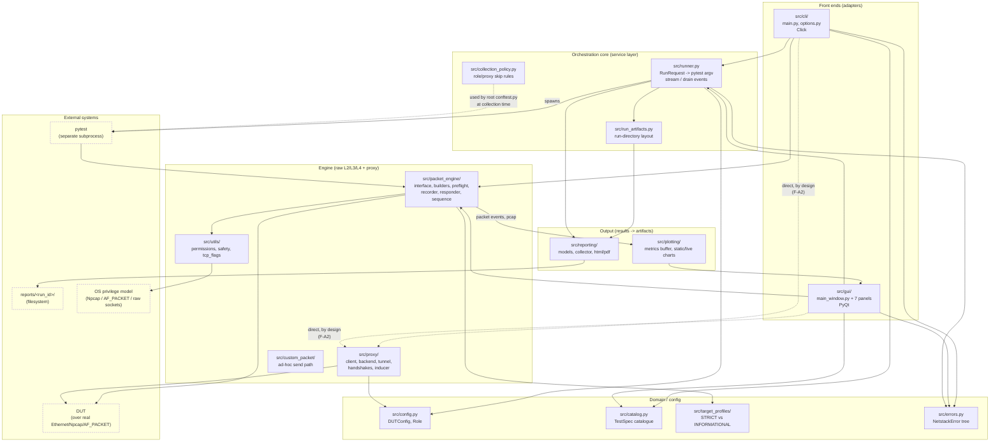

# Architecture Audit — netstack-test-suite

**Date:** 2026-09-11
**Commit:** `34471b7` (branch `development`)
**Scope:** all 16,481 lines of Python across `src/` (58 modules), `tests/`, `tests_internal/`, `conftest.py`, `tools/`, `packaging/`.
**Method:** full read of `docs/architecture.md` and every `src/` package `README.md`; the import graph rebuilt independently (module-level `from`/`import` resolution, matching the method in `tests_internal/test_import_graph.py`) and cross-checked against the coupling tables already published in [`code-complexity-audit.md`](code-complexity-audit.md); every class over 100 lines and every module doing cross-package orchestration read in full.
**Severity scale:** 1 = cosmetic, 10 = actively causing defects.
**Prompt source:** adapted from Jeremy Morgan's [Claude-Code-Reviewing-Prompts](https://github.com/JeremyMorgan/Claude-Code-Reviewing-Prompts) — see [README.md](README.md).

## Relationship to the existing audits

This report answers a different question than the four audits already in
this folder, but it draws on their measurements rather than re-deriving
them: [complexity](code-complexity-audit.md) already computed exact
coupling (Ce/Ca/instability) for every `src/` module and found the import
graph a clean DAG apart from one now-fixed cycle; [design
patterns](design-patterns-audit.md) already classified every class and
dispatch site against the GoF/PoEAA catalogues and found the pattern
choices — Command, Facade, Service Layer, Value Object — correct; both
sets of findings were applied. Where this audit's conclusions match
theirs, it says so and cites the finding rather than re-arguing it. Where
it disagrees or finds something new, that is called out explicitly.

---

## Executive summary

**This is a layered desktop application with one orchestration core and
two thin front ends, and the layering is real — not aspirational.**
Independently rebuilding the `src/` import graph confirms zero edges run
from the engine/domain layer (`packet_engine/`, `proxy/`, `target_profiles/`,
`config.py`, `catalog.py`, `errors.py`) back up into either front end
(`cli/`, `gui/`) or into the output layer (`reporting/`, `plotting/`). That
is the property a layered architecture claims and most don't actually have.

There is **no God object**. The two largest classes by line count —
`MainWindow` (491 lines) and `catalog.py`'s module-level `CATALOG` (622
lines, but a flat data literal, CC 1 throughout) — were both already
identified and partially split by the complexity audit
([F-03](code-complexity-audit.md), [F-08](code-complexity-audit.md)); what
remains is inherent to their role (a Qt shell wiring seven panels; a
declared list of ~90 test specs) rather than a dumping ground.

**Modularity: 8.5/10.** The deduction is not for anything broken — it is
for one missing guard (**F-A1**) and one boundary that is correct in
practice but undocumented as a rule (**F-A2**). Both are cheap to close.

| Question | Answer |
|---|---|
| Clear separation of concerns? | Yes — five layers, each with one job (see diagram). |
| Architectural pattern? | **Layered**, with a **Facade/Service-layer** core (`runner.py`) shared by two adapters (CLI, GUI). Not MVC (no framework-level controller/view split), not microservices (one process, one deployable). |
| God objects? | None. See above. |
| Clean dependency flow? | Yes, confirmed by independent graph rebuild — one DAG, no cycles, no upward edges. |
| Modularity (1-10)? | **8.5** |

---

## Architecture diagram



**Data flow, end to end.** A front end builds a `DUTConfig` +
`RunRequest`, `runner.py` renders it to a pytest argv and spawns pytest as
**a separate subprocess** ([`docs/architecture.md`](../docs/architecture.md)
§"Subprocess-based test execution" — deliberate: repeated in-process
`pytest.main()` risks module-cache pollution and a test crash taking the
GUI down with it). The subprocess's `packet_engine`/`proxy` code talks to
the real DUT over the wire; two JSON-lines files
(`report_log.jsonl`, `packet_events.jsonl`, both named through
`RunArtifacts`) stream progress back to the parent, which both front ends
drain with the *same* `runner.py` functions
(`drain_test_events`/`drain_packet_events` — see the design-patterns
audit's [F-16](design-patterns-audit.md)). `reporting/` and `plotting/`
consume only `src.reporting.models` types, never the engine layer directly.

**Bottleneck, by design, not by accident.** The subprocess boundary is the
one deliberate serialization point in the whole pipeline — a run cannot
proceed faster than pytest can be launched and polled at
`POLL_INTERVAL_S`. This is called out explicitly in
[`docs/architecture.md`](../docs/architecture.md) as the tradeoff for
process isolation, and `MetricsBuffer`'s ~25 Hz decimation
(same doc, "Live plotting cadence") exists specifically to stop the *GUI's*
rendering from becoming a second bottleneck downstream of it. No other
part of the system serializes: `packet_engine` and `proxy` run in the
subprocess and never contend with the parent process for anything but
these two append-only files.

---

## Findings

### F-A1 — The import-graph guard checks for cycles, not for layering direction — **Severity 4**

**Where.** [`tests_internal/test_import_graph.py`](../tests_internal/test_import_graph.py) — `test_src_import_graph_has_no_cycles` runs a DFS over the whole `src/` graph and asserts no cycle exists. `test_proxy_package_imports_nothing` pins one specific past cycle. Neither test has any notion of *layer*: nothing would fail if `src/packet_engine/interface.py` grew `from src.gui.log_panel import LogPanel`, or if `src/reporting/models.py` imported `src.cli.main`. Today the graph is a clean DAG **and** every edge already respects the layering in the diagram above (independently confirmed in this audit — see the Bash grep for reverse imports run against every non-front-end package: zero hits). But that is a property of the code today, not a property the test suite enforces going forward.

**Why it matters.** This is exactly the gap the cycle-guard was built to close for cycles specifically — the design-patterns audit's [F-07/F-07a](code-complexity-audit.md) fixed one real cycle and the test now pins it. Layering violations are the more common failure mode in practice: a future contributor adding "just one more field" to a report and reaching for `from src.gui.report_panel import _export` to reuse a formatting helper would pass every existing check (no cycle is created — `gui` already sits above `reporting` in the graph) while quietly making the output layer depend on Qt.

**Remediation.** Extend the existing AST-based graph (already built once, in `_import_graph()`) with a small allowed-layer table, so the same infrastructure this audit used to verify the diagram becomes a permanent CI check rather than a one-time audit finding:

```python
# tests_internal/test_import_graph.py — add alongside the existing tests

# Layer -> the layers it may import from. Front ends may reach into
# everything below them; everything below may only reach sideways or down.
_LAYER = {
    "src.cli": 4, "src.gui": 4,
    "src.runner": 3, "src.run_artifacts": 3, "src.collection_policy": 3,
    "src.reporting": 2, "src.plotting": 2,
    "src.packet_engine": 1, "src.proxy": 1, "src.custom_packet": 1, "src.utils": 1,
    "src.config": 0, "src.catalog": 0, "src.target_profiles": 0, "src.errors": 0, "src.paths": 0,
}


def _layer_of(module: str) -> int:
    # Longest matching prefix, so "src.gui.report_panel" resolves via "src.gui".
    prefix = max((p for p in _LAYER if module == p or module.startswith(p + ".")), key=len)
    return _LAYER[prefix]


def test_no_upward_or_reverse_layer_imports() -> None:
    graph = _import_graph()
    violations = [
        f"{src} (layer {_layer_of(src)}) -> {dst} (layer {_layer_of(dst)})"
        for src, deps in graph.items()
        for dst in deps
        if _layer_of(src) < _layer_of(dst)
    ]
    assert not violations, "layering violation(s):\n" + "\n".join(sorted(violations))
```

This reuses `_import_graph()` verbatim — no new parsing logic, just a policy over the edges it already returns. Same-layer edges (`gui` importing `cli`, which doesn't happen but isn't forbidden either) are intentionally left unchecked; the rule that matters is "nothing below front ends imports upward," which is the one this codebase actually depends on holding.

---

### F-A2 — Both front ends reach into `proxy/` and `packet_engine/` directly, bypassing `runner.py` for preflight — **Severity 2** · confirmed correct, recommend documenting only

**Where.** `cli/main.py:36` and `gui/main_window.py:43` both `from src.packet_engine.preflight import run_preflight` directly; `cli/main.py:38` and `gui/main_window.py:44` both import from `src.proxy.backend`/`src.proxy.config` directly, rather than through `runner.py`.

**Why this is not a defect.** `runner.py`'s job, per its own module boundary (confirmed in the complexity audit's coupling table: Ce=4, importing only `config`, `packet_engine.payloads`, `reporting.models`, `paths`, `run_artifacts`, `errors`), is specifically *running the pytest subprocess and parsing its output* — not every possible pre-run or ad-hoc action. Preflight is a synchronous, side-effect-free connectivity probe that both front ends need to run and render **before** deciding whether to call `runner.py` at all; routing it through the orchestration layer would make `runner.py` responsible for a decision (abort before spawning anything) that belongs to the caller. Likewise `proxy.backend.EchoBackend` (the `proxy-serve` companion process) and the CLI's `send` subcommand are independent entry points that never invoke `run_tests`, so there is nothing to route through.

**Why it is worth a line of documentation anyway.** `docs/architecture.md` is explicit that "`gui/run_controller.py` drives the equivalent subprocess via `QProcess`... and reuses `runner.py`'s `build_pytest_args`/`drain_test_events`/`drain_packet_events` directly, so the CLI and GUI can never drift into constructing or parsing a run differently" — but it says nothing about the *other* shared surface (preflight, the proxy backend, the custom-packet sender), leaving a reader to infer from the import list that this is also a deliberate, shared boundary rather than two front ends independently reinventing pre-run checks. One paragraph closes the gap:

```markdown
## Shared surfaces outside the run itself

Not every front-end/engine interaction goes through `runner.py` — only the
pytest run does. Preflight (`packet_engine/preflight.py`), the proxy
backend (`proxy/backend.py`), and the custom-packet sender
(`custom_packet/sender.py`) are independent, synchronous operations that
both `cli/main.py` and `gui/main_window.py` import directly, by design:
each is a complete action in itself (probe connectivity, run an echo
server, send one packet) with no subprocess and no run to route through.
`runner.py` stays scoped to "build and drain one pytest invocation."
```

No code change; this is a documentation-only finding, recorded so a future
audit (or contributor) does not mistake the direct imports for drift.

---

## Anti-pattern checklist

| Anti-pattern | Found? | Evidence |
|---|---|---|
| **Spaghetti code** | No | Complexity audit: max nesting depth 4 anywhere in `src/`, no function over CC 21 (the one outlier, `build_pytest_args`, was already flattened to a data table — [complexity F-01](code-complexity-audit.md)). |
| **Copy-paste programming** | No | A dedicated [duplication audit](code-duplication-audit.md) found and closed 19 instances; this audit's own read of the current tree found no new clone (e.g. the three-way payload-source cascade flagged in complexity [F-04](code-complexity-audit.md) is now the single `resolve_custom_source` used by all three call sites). |
| **God classes/modules** | No | See executive summary. `MainWindow` and `catalog.py` are the largest by line count and both are the correct shape for their role (Qt shell; declared data table), already reviewed under complexity [F-03](code-complexity-audit.md)/[F-08](code-complexity-audit.md). |
| **Tight coupling** | No, with one caveat | Coupling audit shows a clean stable-kernel structure (Ce=0 modules with high Ca: `reporting.models`, `utils.tcp_flags`, `config`, `proxy.config`, `packet_engine.payloads`). The two front ends have high *fan-out* (Ce≈14-15 each) but that is inherent to being the composition root of a layered app, not coupling between peers — see [complexity F-02/F-03](code-complexity-audit.md), already reduced in cyclomatic terms and left as-is for import count. |
| **Missing abstractions** | No new ones | The design-patterns audit already found and closed the four real gaps (a run-artifact repository, derived DTO serialization, two enum-dispatch tables, a Strategy for proxy handshakes). Nothing at the architecture level is missing an abstraction that isn't already tracked. |
| **Layering violation** | Not present, but **unguarded** | See **F-A1**. |

---

## Modularity score: 8.5 / 10

**What earns the score.** Five layers with a single responsibility each; a
Facade/Service core reused verbatim by two front ends (not two parallel
implementations); a stable-abstraction kernel with the textbook Ce=0/high-Ca
shape; a subprocess boundary that is the *sole* serialization point and is
called out as deliberate rather than accidental; zero import cycles,
verified both by the existing guard and by this audit's independent
rebuild; every module carries its own `README.md` stating its one job.

**What holds it back from higher.**

- The layering the diagram shows is enforced by discipline, not by a test — **F-A1**. This is the only structural gap found.
- Two composition roots (`cli/main.py`, `gui/main_window.py`) each have high import fan-out (Ce≈14-15). This is already measured and reasoned about in the complexity audit as "correct for a top-level UI shell" / "click's doing, not a design choice" — a real cost (either file is the one most likely to need a touch for any cross-cutting change) but not a design flaw, and not something a layered architecture can avoid at its composition root without introducing a DI container this codebase has deliberately not adopted ([design-patterns F-16](design-patterns-audit.md)).
- **Unable to verify:** runtime import cost of the two composition roots' fan-out (e.g. whether importing `cli/main.py` for just `--help` pays for loading `gui`-adjacent transitive dependencies) — this would need an import-time profile (`python -X importtime`), not a static read, and is out of scope for this audit's method.

---

## Priority order

| # | Finding | Severity | Effort | Note |
|---|---|---:|---|---|
| 1 | **F-A1** Layering-direction test | 4 | ~20 min | Reuses `_import_graph()` verbatim; zero violations expected today — this only prevents future drift. |
| 2 | **F-A2** Document the "shared surfaces outside the run" boundary | 2 | ~10 min | Documentation only; no code change. |

Both are small enough to take together in one pass over
`tests_internal/test_import_graph.py` and `docs/architecture.md`.

---

## Status: both findings applied

- `pytest tests_internal/ -q` -> **317 passed**
- `ruff check .` -> clean

| Finding | Commit | Note |
|---|---|---|
| F-A1 | `371a063` | see correction below |
| F-A2 | `ef622ce` | doc-only, as proposed |

### Where the fix differed from what this report proposed

Running the layering test against the real graph (rather than reasoning
about it from the diagram) surfaced two false positives that the report's
draft layer assignments didn't anticipate:

- `src.packet_engine.interface -> src.reporting.models` — `NetworkInterface`
  builds `PacketEvent`s directly (`docs/architecture.md`'s "One canonical
  result model" section), which is a legitimate, by-design dependency.
- `src.reporting.collector -> src.run_artifacts` and
  `src.reporting.report_data -> src.run_artifacts` — reporting reads a run
  back through the same `RunArtifacts` naming that `runner.py` writes
  through, which is the whole point of that module (see the design-patterns
  audit's F-01).

Both were mis-tiered in the report's draft table by *where the module is
defined* (`reporting.models` under the general `src.reporting` entry;
`run_artifacts` grouped with the orchestration core in the diagram) rather
than *what depends on it*. Both are shared, dependency-free value shapes —
the same tier as `config.py`/`catalog.py`/`errors.py` — so the applied
table pins `src.reporting.models` and `src.run_artifacts` to layer 0 ahead
of the general `src.reporting` entry, rather than changing the diagram's
narrative grouping (which still describes their *role* accurately; only
the enforcement tier moved). See the comment above `_LAYER` in
`tests_internal/test_import_graph.py` for the same note in context.
