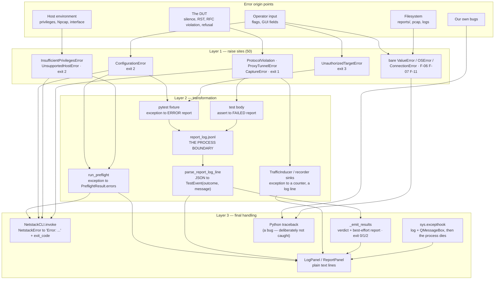

# Error Flow Audit — netstack-test-suite

**Date:** 2026-09-10
**Commit:** `a3a339e` (branch `development`)
**Scope:** the *path* every failure takes from where it originates to where a
human sees it — across `src/` (58 modules), `conftest.py`, `tests/conftest.py`,
the per-package `tests/*/conftest.py` fixtures, and both entry points
(`src/cli/main.py`, `src/gui/app.py`).
**Method:** full read of every `src/` module; census of all 50 `raise` sites and
41 `except` clauses; every thread entry point, Qt slot and pytest fixture traced
to its enclosing handler; five findings reproduced at runtime in the project
venv (marked **Reproduced**). Baseline at this commit: `pytest tests_internal/ -q`
→ **291 passed**, `ruff check .` → clean.

**Severity scale:** 1 = cosmetic, 10 = actively causing defects / safety-relevant.
**Prompt source:** adapted from Jeremy Morgan's [Claude-Code-Reviewing-Prompts](https://github.com/JeremyMorgan/Claude-Code-Reviewing-Prompts) — see [README.md](README.md).

**Relationship to the earlier audit.** [error-handling-audit.md](error-handling-audit.md)
(commit `4653b25`, 22 findings, all applied) inventoried *handlers*: which sites
raise, which catch, which exit code each produces. This audit takes the
complementary cut the prompt asks for — it follows each failure *through* the
layers and asks whether the thing the operator finally reads still means what
the origin meant. Nothing below restates a finding from that audit; where a
finding is the residue of an applied one, it says so.

---

## Scope note: what the prompt's five paths mean here

This package has no database, no third-party HTTP API and no user accounts. It
is a Click CLI (`netstack-cli`), a PySide6 desktop app (`netstack-gui`), a
pytest subprocess, and a raw-Ethernet packet engine. Rather than invent
equivalents, each requested path is mapped to the thing in this codebase that
occupies the same structural position, and the mapping is stated so the traces
below can be checked against it:

| Prompt's path | The equivalent here | Where it lives |
|---|---|---|
| Database connection failure | The run-artifact store: `reports/<run_id>/`, `results.json` written by `finalize_run` and read back by `RunArtifacts.load` | `src/run_artifacts.py`, `src/runner.py:279`, `src/reporting/collector.py:60` |
| Third-party API timeout | The DUT's silence (`srp1` returning `None`), socket timeouts through the proxy, and the pytest **subprocess** as the out-of-process dependency both front ends depend on | `packet_engine/interface.py:97`, `proxy/client.py:115`, `runner.py:294`, `gui/run_controller.py` |
| Invalid user input | Click options, pytest options, GUI widget state, payload sources | `cli/options.py`, `cli/main.py:105`, `packet_engine/payloads.py`, `gui/main_window.py:407` |
| Authentication failure | Three distinct ones: **host privilege** (raw-socket elevation), **authorization** (the `vuln` allow-list gate), and the **DUT's** proxy auth (RFC 1929 / HTTP 407) | `utils/permissions.py:88`, `utils/safety.py:20`, `proxy/handshakes.py:125` |
| File system errors | pcap writers, the debug log, the jsonl event logs, report output, `gui.log` | `packet_engine/pcap.py`, `utils/debug_log.py`, `reporting/collector.py`, `utils/logging_config.py:29` |

There is no HTTP status vocabulary to categorise against; the categories this
package actually has are the ones the earlier audit named (configuration,
privilege, authorization, lookup, peer protocol, unhandled), and this report
uses them.

---

## The error flow, end to end

Two processes are involved in every run. The parent (CLI or GUI) never sees a
test's exception object — only its serialized shadow: a report-log JSON line
that the parent parses back into a `TestEvent`. That process boundary is the
single most important fact about error flow here, and it is where meaning is
most easily lost.



### Transformation layers, stated flatly

| # | Layer | Input | Output | Loses |
|---|---|---|---|---|
| 1 | `run_preflight` | any exception from Scapy / `require_elevation` | `PreflightResult(ok=False, errors=[str])` | the type and traceback (F-14) |
| 2 | pytest fixture setup | any exception | report-log line, `when="setup"`, `outcome="failed"` | the type; becomes `TestOutcome.ERROR` |
| 3 | test body | `assert` / raised exception | report-log line, `when="call"` | the type; becomes `TestOutcome.FAILED` |
| 4 | **process boundary** | report-log JSON | `TestEvent(outcome, message)` where `message` = `longrepr.reprcrash.message` | everything but one line of text |
| 5 | `_emit_results` / `_on_finished` | `TestRunResult` | console lines, exit code, PDF/HTML | nothing further |
| 6 | `NetstackCLI.invoke` | `NetstackError` | `Error: <msg>` + `exc.exit_code` | the traceback (by design) |
| 7 | `sys.excepthook` (GUI) | anything escaping a slot | log record + modal dialog, **then the process terminates** | the session (F-03) |

Layer 4 is why the categories in `src/errors.py` stop mattering the moment a
failure happens inside the pytest subprocess: `UnauthorizedTargetError`,
`ConfigurationError` and an `AssertionError` all arrive at the parent as a
string plus an outcome enum. That is a deliberate, sound design — but it means
the *classification* work has to happen before the boundary, which is exactly
what F-05 gets wrong.

### Recovery mechanisms that exist today

| Mechanism | Where | Recovers what |
|---|---|---|
| Best-effort report generation | `cli/main.py:196`, `report_panel.py:79` | the run's verdict survives a reportlab/matplotlib failure |
| Per-frame flush (`PcapWriter(sync=True)`, `DebugLogger`, `PacketEventLogWriter`) | `packet_engine/pcap.py:19`, `debug_log.py`, `collector.py` | evidence survives an abrupt exit |
| Line-level tolerance in both drain loops | `runner.py:446`, `runner.py:508` | one truncated jsonl line costs one event, not the run |
| Regeneration from `results.json` | `collector.load_run_result` | a report can be rebuilt without re-touching the DUT |
| Inducer backoff + failure tally | `inducer.py:102-116` | a permanently unreachable origin stops burning connect attempts |
| All-or-nothing bind | `backend.py:118-127` | a partial `EchoBackend` start releases whatever bound |
| Socket release on handshake failure | `client.py:50-60` | a refused tunnel does not leak an fd per attempt |

What is **missing** from that list is any recovery for the run's own artifact
writes (F-03) and for an interrupted run (F-02).

---

## Path-by-path trace

### 1. "Database" — the run-artifact store

| Question | Answer |
|---|---|
| Where caught | `RunArtifacts.save`/`load`: **nowhere**. `new_run_dir` (`runner.py:270`), `artifacts.pytest_output.open` (`runner.py:319`), `finalize_run` → `save` (`runner.py:279`) are all unguarded. |
| How transformed | Not transformed. An `OSError` propagates as itself. |
| What is logged | Nothing. |
| What the user sees | CLI: a raw traceback (not a `NetstackError`, so `NetstackCLI.invoke` does not render it) — after the tests have already run. GUI: `finalize_run` is called from `_on_finished`, a Qt slot, so the exception reaches `sys.excepthook` and the process dies. |
| State consistency | The pcap and the debug log are already flushed per frame, so the on-disk evidence survives; the *verdict* does not. `results.json` is the only thing `reporting.collector.load_run_result` can read back, so the run becomes unregenerable. |

→ **F-03**.

The read side is better: `collector.load_run_result` is only called for a
directory the operator picked, and `TestRunResult.from_dict` tolerates missing
keys (`models.py:181`) so an older `results.json` still loads.

### 2. "Third-party timeout" — the DUT's silence, and the subprocess

Three sub-paths, with three different qualities of handling.

**2a. Packet-level silence.** `NetworkInterface.send_receive` returns `None`
when `srp1` times out (`interface.py:97`). No exception exists; every test
asserts on `None` itself. This is correct and is the suite's core idiom.
`DUTConfig` deliberately has no `retries` field, and the reasoning is recorded
at `config.py:161`.

**2b. Proxy socket timeouts.** `ProxyClient._recv_exact` raises
`ConnectionError` on a short read; `read_until_eof` catches `socket.timeout`
and **treats it as EOF** (`client.py:122`). That single `break` inverts the
verdict of two conformance tests → **F-01**, the most serious finding here.

**2c. The pytest subprocess.** The parent tails two jsonl files. Both drain
loops are guarded (applied as F-08 of the earlier audit). Process-level
outcomes: exit ≥ 2 → `TestRunResult.errored` → "collection/usage error";
`FailedToStart` → `RunController._on_error`; a kill → `finished(62097,
CrashExit)`, which the code misreads as a collection error → **F-04**. A
`KeyboardInterrupt` in the CLI's blocking loop escapes with no finalize →
**F-02**.

### 3. Invalid user input

| Question | Answer |
|---|---|
| Where caught | CLI: Click's own type/choice validation, plus `_validate_cidrs` (`cli/main.py:105`) at parse time, and `NetstackCLI.invoke` (`cli/main.py:80`) for `ConfigurationError`. pytest: `pytest.fail` in `dut_config` / `proxy_config`. GUI: `_report_topology` / `_preflight_and_report` return `False` and write to the log panel. |
| How transformed | `bytes.fromhex`'s `ValueError` → `ConfigurationError` (`payloads.py:57`); an unreadable file's `OSError` → `ConfigurationError` (`payloads.py:64`); a bad CIDR → `click.BadParameter` at parse time or `ConfigurationError` in `target_in_allowed_range` (`config.py:217`). |
| What is logged | Nothing — these are operator input, not events. |
| What the user sees | `Error: payload hex is not valid hex: ...` and exit 2. Consistent, and it names the flag. |
| State consistency | Nothing has been sent at this point. Clean. |

Two leaks remain: an unknown target stack (`registry.py:16`) and an incomplete
proxy topology (`proxy/config.py:80`) raise **bare `ValueError`** → **F-06**,
**F-07**. And the GUI silently discards an unparseable port → **F-08**.

### 4. "Authentication" — three of them

**4a. Host privilege.** `require_elevation` → `InsufficientPrivilegesError`
(exit 2), carrying OS-specific remediation text. Caught by `run_preflight`
(`preflight.py:52`) and rendered as a `[FAIL]` line in both front ends; also
raised inside the `network_interface` fixture, where it becomes a setup ERROR
on every test. Correct, and the message is actionable.

**4b. Authorization (the `vuln` gate).** `enforce_vuln_test_authorization` is
autouse-driven off the `vuln` marker (`conftest.py:213`) — enforcement by
mechanism, not convention. It raises `UnauthorizedTargetError` (exit 3) *in the
subprocess*, so it arrives at the parent as a setup ERROR carrying the message
text. It fails closed: `target_in_allowed_range` returns `False` for an empty
allow-list and raises `ConfigurationError` for malformed input. No finding.

**4c. The DUT's proxy auth.** HTTP 407 gets a hint (`handshakes.py:53`); SOCKS5
RFC 1929 failure raises `ProxyTunnelError`. But the auth-path raises pass **no
`details`** (`handshakes.py:125,130,136,140`), while the CONNECT and
CONNECT-reply paths do → **F-12**. And a refusal during fixture setup is filed
as a harness error rather than a DUT verdict → **F-05**.

### 5. File system errors

| Origin | Caught? | Becomes |
|---|---|---|
| `reports/<run_id>` unwritable | no | traceback / GUI abort (**F-03**) |
| `open_pcap` on the first frame (`interface.py:127`) | no | the exception fails whichever test happened to send the first packet — an FS error wearing a protocol failure's clothes |
| `DebugLogger.__init__` (`debug_log.py:97`) | no | escapes `pytest_configure` → the whole session errors before collection |
| `PacketEventLogWriter.__init__` (`collector.py:47`) | no | escapes the `network_interface` fixture → every test ERRORs |
| write **after** close (`collector.py:52`) | yes, dropped | correct: a plot point after teardown is worth nothing |
| report generation (`cli/main.py:197`, `report_panel.py:80`) | yes, logged | the verdict survives; correct (applied as F-16/F-17 earlier) |
| `gui.log` unwritable (`logging_config.py:29`) | yes, **silently** | the operator never learns why there is no log file (**F-15**) |

The pcap/debug-log/jsonl trio share one shape: **they open lazily or late, on a
path where their failure is attributed to something else.** Only the first is a
mid-run surprise; the other two fail fast, which is defensible.

---

## Anti-pattern census

| Anti-pattern | Instances | Verdict |
|---|---|---|
| Swallowed exception (empty `except`) | `logging_config.py:29` (`pass`), `tests/tcp/conftest.py:82` (`pass`) | one finding (**F-15**); the tcp teardown is correct — a best-effort RST that must never mask the test outcome |
| Generic catch-all hiding specifics | `cli/main.py:197`, `report_panel.py:80`, `custom_packet_panel.py:189`, `preflight.py:72`, `recorder.py:118`, `inducer.py:102`, `permissions.py:39`, `main_window.py:442` | 6 of 8 are deliberate and documented at the site; **F-10** (no logging at all) and **F-14** (bugs rendered as interface errors) are findings |
| Errors used for flow control | `backend.py:170,186,214` (`socket.timeout` → `continue`), `client.py:122` (`socket.timeout` → `break`), `payloads.py:127` (`KeyError` → `ValueError`) | the accept/recv loops are the standard poll-able-socket idiom — fine. `client.py:122` is **F-01** |
| Missing error boundary | `finalize_run` in a Qt slot (**F-03**); `run`'s `KeyboardInterrupt` (**F-02**); `EchoBackend`'s three loop threads (**F-09**) | 3 findings |
| Inconsistent error format | `Error: {exc}` (CLI), `[FAIL] {msg}` (preflight), `Could not write the {label} report: {exc}` (both report paths), `Error: {exc}` with no type (custom-packet panel), `Failed to start: {exc}` (proxy panel), `{type}x{count}` (inducer tally) | **F-16**, and the template below |
| Silent fallback on bad input | `main_window.py:425` (bad port → `None` → a default) | **F-08** |
| `assert` as a runtime guard | `runner.py:290`, `run_controller.py:103,112,130`, `proxy/config.py:98` | **F-13** — the earlier audit's F-11 established that `python -O` strips these |

---

## Findings

| ID | Finding | Severity | Category |
|---|---|---|---|
| F-01 | `read_until_eof` treats a read timeout as a clean EOF — two conformance tests pass on a DUT that never propagates FIN | 8 | Peer protocol |
| F-02 | `Ctrl+C` during `netstack-cli run` leaves no `results.json` and prints a traceback | 6 | Recovery |
| F-03 | Run-artifact filesystem failures have no category and no boundary; in the GUI they kill the process | 6 | File system |
| F-04 | A user-initiated **Stop** is recorded as "pytest collection/usage error" | 5 | Information |
| F-05 | The `proxy_client` fixture files a DUT tunnel refusal as a harness ERROR, not a test FAIL | 5 | Peer protocol |
| F-06 | `get_profile` raises a bare `ValueError` — outside the hierarchy | 4 | Lookup |
| F-07 | `ProxyConfig.__post_init__` raises a bare `ValueError`; `ProxyMode(None)` is unguarded | 4 | Configuration |
| F-08 | `_split_host_port` silently discards an unparseable port | 4 | Configuration |
| F-09 | `EchoBackend`'s loops `return` on `OSError` with no record; the panel still says "Listening" | 4 | Async |
| F-10 | `CustomPacketPanel._on_send` catches everything and logs nothing | 4 | Information |
| F-11 | `tunnel.py` raises builtin `ConnectionError` for DUT-caused truncation (3 sites) | 3 | Peer protocol |
| F-12 | SOCKS5 auth failures carry no `details`, unlike every other `ProxyTunnelError` | 3 | Peer protocol |
| F-13 | `assert` used for cross-callback invariants that `python -O` strips | 3 | Consistency |
| F-14 | `run_preflight`'s `except Exception` renders our own bugs as "Could not send on interface" | 3 | Information |
| F-15 | `configure_logging` drops the file handler silently | 2 | Information |
| F-16 | Six different user-facing error formats; no shared renderer | 3 | Consistency |

---

### F-01 — `read_until_eof` treats a read timeout as a clean EOF (severity 8) — **Reproduced**

`src/proxy/client.py:115-127`:

```python
    def read_until_eof(self, limit: int = 1 << 20) -> bytes:
        buffer = bytearray()
        while len(buffer) < limit:
            try:
                chunk = self.socket.recv(RECV_CHUNK)
            except socket.timeout:
                break            # <-- indistinguishable from a clean close
            if not chunk:
                break
            buffer += chunk
        return bytes(buffer)
```

Both callers assert `read_until_eof() == b""` and read that as *"the origin's
FIN was relayed back to us"*:

- `tests/proxy/test_proxy_lifecycle.py:28` — "Expected a clean EOF after
  half-closing … The DUT may not be propagating shutdown."
- `tests/proxy/test_proxy_lifecycle.py:47`

A DUT that never propagates the half-close produces exactly the same `b""`
after `config.timeout` seconds. The test whose docstring says it detects "a
hang" **passes on the hang**. This is the one failure shape a conformance suite
must never have: a false pass on the defect the test exists to find.

Reproduced against a stand-in origin that echoes and then never closes:

```
echo: b'last-write'
read_until_eof returned: b''
TEST WOULD PASS: True (DUT never propagated the FIN)
```

**Remediation** — make EOF and timeout different outcomes. `src/proxy/client.py`:

```python
from src.errors import ProtocolViolation

    def read_until_eof(self, limit: int = 1 << 20) -> bytes:
        """Read until the peer closes. Raises on timeout: a peer that never
        closes is the defect the lifecycle tests look for, and returning the
        same empty bytes for both scores that defect as a clean EOF."""
        buffer = bytearray()
        while len(buffer) < limit:
            try:
                chunk = self.socket.recv(RECV_CHUNK)
            except socket.timeout:
                raise ProtocolViolation(
                    f"no EOF within {self.config.timeout}s after "
                    f"{len(buffer)} byte(s) — the DUT did not propagate the "
                    "peer's close (RFC 9293 §3.6)"
                ) from None
            if not chunk:
                break
            buffer += chunk
        return bytes(buffer)
```

`ProtocolViolation` already subclasses `ValueError`, so nothing that catches
`ValueError` around a relay call changes behaviour. The two assertions then
read as they were written — a hang raises with a message naming the RFC clause,
and `b""` genuinely means EOF. `tests_internal/test_proxy_relay.py:229`
exercises the real-EOF case against a live `EchoBackend` and is unaffected.

---

### F-02 — `Ctrl+C` during a run leaves no `results.json` (severity 6)

`src/cli/main.py:326` calls `run_tests(request, ...)`, which blocks in
`stream_run`'s poll loop (`src/runner.py:322-334`). There is no
`KeyboardInterrupt` handling anywhere on that path, and `subprocess.Popen`
(`runner.py:320`) is not used as a context manager and has no `finally:`.

So an interrupted run:

- never reaches `finalize_run`, so `results.json` is never written and the run
  cannot be reopened by `collector.load_run_result` or re-reported;
- prints a raw traceback rather than the "Stopping…" line the *other* two
  long-running commands print (`record` at `cli/main.py:464`, `proxy-serve` at
  `cli/main.py:509` both handle `KeyboardInterrupt` explicitly);
- leaves the events already drained into `result` in memory only.

The pcap and debug log survive (both flush per frame), so the evidence is on
disk — it is the verdict and the machine-readable record that are lost.

**Remediation** — `src/runner.py`, inside `stream_run`, so both front ends
benefit and the child is not left running:

```python
        try:
            while proc.poll() is None:
                report_offset = drain_test_events(report_log, report_offset, result, on_test_event)
                events_offset = drain_packet_events(events_log, events_offset, result, on_packet_event)
                yield result
                time.sleep(POLL_INTERVAL_S)
        except (KeyboardInterrupt, GeneratorExit):
            # Interrupting the parent must not orphan the child (it is sending
            # real frames at the DUT) or discard a run's worth of results.
            proc.terminate()
            proc.wait(timeout=10)
            raise
        finally:
            report_offset = drain_test_events(report_log, report_offset, result, on_test_event)
            events_offset = drain_packet_events(events_log, events_offset, result, on_packet_event)
            finalize_run(result, run_dir, proc.returncode)

    yield result
```

and `src/cli/main.py`, in `run`, so the operator gets a verdict rather than a
traceback:

```python
    try:
        result = run_tests(request, on_test_event=on_test_event)
    except KeyboardInterrupt:
        click.echo("\nInterrupted — partial results were saved.", err=True)
        raise SystemExit(130) from None
```

**Note on scope:** on a terminal `Ctrl+C` the console signal reaches the whole
process group, so pytest usually receives it too and exits on its own. The
`terminate()` above matters for the case where it does not (a
`KeyboardInterrupt` raised programmatically, or a non-console parent) —
*Unable to verify* which applies across every host/shell combination. The
finalize-and-exit-code half of the fix is unconditional.

---

### F-03 — Run-artifact filesystem failures have no category and no boundary (severity 6)

Three unguarded filesystem writes sit on the run's critical path:

| Site | Called from | Consequence of an `OSError` |
|---|---|---|
| `runner.new_run_dir` → `mkdir` (`runner.py:272`) | CLI `stream_run`; GUI `RunController.start`, itself called from the `clicked` slot `_on_run_clicked` | CLI: traceback. GUI: `sys.excepthook` → dialog → **process terminates** |
| `artifacts.pytest_output.open("w")` (`runner.py:319`) | CLI only | traceback before any test runs |
| `finalize_run` → `RunArtifacts.save` → `write_text` (`run_artifacts.py:96`) | CLI `stream_run`; GUI `RunController._on_finished` — **a Qt slot** | the verdict of a run that may have taken an hour is lost; in the GUI the window dies with it |

None of these is a `NetstackError`, so `NetstackCLI.invoke` (`cli/main.py:80`)
deliberately does not render them — its narrowness is correct, and the gap is
that this category was never given a class. `src/gui/app.py:63` documents that
the excepthook makes a slot exception *visible*, not survivable.

**Remediation** — give the category a class, then use it at the three sites.
`src/errors.py`:

```python
class RunArtifactError(NetstackError):
    """A run's artifact directory or results file could not be written.

    The pcap and the debug log flush per frame, so the evidence survives —
    it is the verdict and the machine-readable record that do not.
    """
```

`src/run_artifacts.py`:

```python
    def save(self, result: TestRunResult) -> None:
        try:
            self.root.mkdir(parents=True, exist_ok=True)
            self.results.write_text(json.dumps(result.to_dict(), indent=2), encoding="utf-8")
        except OSError as exc:
            raise RunArtifactError(
                f"Could not write {self.results}: {exc}. The run completed; its "
                "pcap and logs are already on disk in the same directory."
            ) from exc
```

and, so the GUI slot cannot take the window with it,
`src/gui/run_controller.py`:

```python
    def _on_finished(self, exit_code: int, exit_status: QProcess.ExitStatus) -> None:
        self._timer.stop()
        self._drain()
        if self._result is None or self._run_dir is None:
            return
        try:
            result = finalize_run(self._result, self._run_dir, exit_code)
        except NetstackError as exc:
            self.failed.emit(str(exc))
            result = self._result  # the in-memory run is still complete
        self.finished.emit(result)
```

Apply the same `try` around `new_run_dir()` in `start()`, emitting `failed`
instead of raising.

---

### F-04 — A user-initiated Stop is recorded as a collection error (severity 5) — **Reproduced**

`src/gui/run_controller.py:127` accepts `exit_status` and never reads it:

```python
    def _on_finished(self, exit_code: int, exit_status: QProcess.ExitStatus) -> None:
        self._timer.stop()
        self._drain()
        assert self._result is not None and self._run_dir is not None
        self.finished.emit(finalize_run(self._result, self._run_dir, exit_code))
```

`stop()` (`run_controller.py:76`) calls `QProcess.kill()`. Measured in this
project's venv:

```
exit_code = 62097 | exit_status = ExitStatus.CrashExit | errored(>=2) = True
```

`TestRunResult.errored` is `pytest_returncode >= 2` (`models.py:143`), so
pressing **Stop** produces, in the Log tab and the Report panel:

> pytest exited with code 62097 (collection/usage error or no tests)

and writes that `pytest_returncode` into `results.json`, so every PDF/HTML
report regenerated from that run repeats it. The operator's own deliberate
action is reported back to them as a suite malfunction, and the partial results
that *were* collected are labelled untrustworthy.

**Remediation** — `src/gui/run_controller.py`:

```python
    def __init__(self, parent: QObject | None = None) -> None:
        ...
        self._stopping = False

    def stop(self) -> None:
        if self._process is not None and self._process.state() != QProcess.ProcessState.NotRunning:
            self._stopping = True
            self._process.kill()
        else:
            self._timer.stop()

    def _on_finished(self, exit_code: int, exit_status: QProcess.ExitStatus) -> None:
        self._timer.stop()
        self._drain()
        if self._result is None or self._run_dir is None:
            return
        # A killed process reports a crash exit code that is not pytest's.
        # Recording it as one turns "the operator pressed Stop" into "pytest
        # failed to collect" — in the log, in results.json, and in every
        # report regenerated from it afterwards.
        stopped = self._stopping or exit_status is QProcess.ExitStatus.CrashExit
        self._stopping = False
        self.finished.emit(
            finalize_run(self._result, self._run_dir, None if stopped else exit_code)
        )
```

`pytest_returncode=None` is already the documented "still running / no code"
value (`models.py:118`) and makes `errored` `False`, so the results collected
before the stop are presented as what they are. In `MainWindow._on_finished`,
add the corresponding line: "Run stopped — N tests completed before the stop."

---

### F-05 — A DUT tunnel refusal is filed as a harness ERROR, not a test FAIL (severity 5)

`tests/proxy/conftest.py:55-67`:

```python
    client = ProxyClient(proxy_config)
    try:
        client.connect()
    except (OSError, ConnectionError) as exc:
        pytest.fail(
            f"Could not establish a tunnel through the proxy DUT at ..."
        )
```

`ProxyTunnelError` — the class that exists precisely to say *"the DUT refused
or mishandled the handshake"* (`errors.py:83`) — is **not** in that tuple. It
derives from `NetstackError`, not `OSError`. So when the DUT answers CONNECT
with 502, or SOCKS5 with `0x05 connection refused`, the fixture raises out of
setup and every test using `proxy_client` is reported as an **ERROR**.

Downstream that means: `parse_report_log_line` maps a non-passing `setup` phase
to `TestOutcome.ERROR` (`runner.py:472`); `TestRunResult.errors` counts it as
"fixture/setup failure … distinct from `failed`" (`models.py:154`); and the
report's error bucket — the one a reader scans for *suite* problems — fills up
with what are actually *DUT conformance verdicts*. The operator also loses the
carefully built message, including the CONNECT hint added at `handshakes.py:53`
("the proxy requires authentication…", "is the backend instance running?").

Secondary: `ConnectionError` is a subclass of `OSError`, so the tuple's second
member is redundant.

**Remediation** — `tests/proxy/conftest.py`:

```python
from src.errors import ProxyTunnelError

    client = ProxyClient(proxy_config)
    try:
        client.connect()
    except ProxyTunnelError as exc:
        # The DUT answered and refused: a conformance verdict, not a harness
        # problem. Fail (not error) so it lands in the report's failure
        # bucket, and keep `details` — the tests assert on what it reported.
        pytest.fail(f"The proxy DUT refused the tunnel: {exc} (reported: {exc.details!r})")
    except OSError as exc:  # ConnectionError is an OSError
        pytest.fail(
            f"Could not establish a tunnel through the proxy DUT at "
            f"{proxy_config.dial_target[0]}:{proxy_config.dial_target[1]} "
            f"to origin {proxy_config.backend_host}:{proxy_config.backend_port} — {exc}. "
            "Is the DUT running, and is the backend instance (`netstack-cli proxy-serve`) up?"
        )
```

Both are `pytest.fail`, so both are FAILs rather than ERRORs; the split decides
which message the operator gets.

---

### F-06 — `get_profile` raises a bare `ValueError` (severity 4) — **Reproduced**

`src/target_profiles/registry.py:12-16`:

```python
def get_profile(name: str) -> TargetProfile:
    try:
        return _PROFILES[name.lower()]
    except KeyError as exc:
        valid = ", ".join(sorted(_PROFILES))
        raise ValueError(f"Unknown target stack {name!r}. Valid options: {valid}") from exc
```

```
get_profile -> ValueError | is NetstackError: False
```

This is the one *lookup* failure the earlier audit's category table named
(`registry.py:14`) that did not get a class when `src/errors.py` was
introduced. `tests_internal/test_errors.py` guards *declared classes*, not
raise-sites of builtins, so nothing catches the omission.

Reachability: the CLI constrains `--target-stack` with `click.Choice`
(`cli/main.py:211`) and the GUI with a combo box, so today it is reached only
via the `target_profile` fixture when `--target-stack` is passed directly to
pytest — where it surfaces as a fixture ERROR with a message about "target
stack" and no indication that a flag is at fault. `UnsupportedHostError` in the
sibling `platform_backend.get_backend` (`platform_backend.py:86`) already does
this correctly, which is what makes the inconsistency visible.

**Remediation** — `src/target_profiles/registry.py`:

```python
from src.errors import ConfigurationError

def get_profile(name: str) -> TargetProfile:
    try:
        return _PROFILES[name.lower()]
    except KeyError as exc:
        valid = ", ".join(sorted(_PROFILES))
        raise ConfigurationError(
            f"Unknown target stack {name!r}. Valid options: {valid}"
        ) from exc
```

`ConfigurationError` subclasses only `NetstackError`, so if any caller relied on
catching `ValueError` here it would break — `grep -rn "get_profile" src tests
tests_internal` shows no `except ValueError` around any call site at this
commit. If one is added later, give the class a `ValueError` base the way
`ProtocolViolation` does rather than reverting this.

---

### F-07 — `ProxyConfig.__post_init__` raises a bare `ValueError` (severity 4) — **Reproduced**

`src/proxy/config.py:78-83`:

```python
    def __post_init__(self) -> None:
        if self.mode.is_explicit and not (self.proxy_host and self.proxy_port):
            raise ValueError(
                f"{self.mode.value} is an explicit proxy mode and needs "
                "proxy_host and proxy_port (the DUT's front address)."
            )
```

```
ProxyConfig -> ValueError | is NetstackError: False
```

The only production constructor is the `proxy_config` fixture
(`conftest.py:186-194`), which catches `ValueError` and calls `pytest.fail` — so
this works *only* because the fixture knows the concrete builtin type. That is
the coupling `src/errors.py` was written to remove, and it breaks the moment a
second caller appears (a GUI proxy-client panel, a `proxy-connect` subcommand):
that caller gets a traceback the entry-point boundary will not render.

Adjacent, same fixture: `ProxyMode(pytestconfig.getoption("--proxy-mode"))` at
`conftest.py:181` sits **outside** the `try`, so a `proxy`-marked test run with
no `--proxy-mode` would raise `ValueError: None is not a valid ProxyMode`.
Today the collection policy skips exactly those tests first
(`collection_policy.py:57`), so it is unreachable — but the fixture's guarantee
rests on a marker on the test, not on anything the fixture itself checks.

**Remediation** — `src/proxy/config.py`:

```python
from src.errors import ConfigurationError

    def __post_init__(self) -> None:
        if self.mode.is_explicit and not (self.proxy_host and self.proxy_port):
            raise ConfigurationError(
                f"{self.mode.value} is an explicit proxy mode and needs "
                "proxy_host and proxy_port (the DUT's front address)."
            )
```

and `conftest.py`, catching the base and closing the enum gap:

```python
    raw_mode = pytestconfig.getoption("--proxy-mode")
    if not raw_mode:
        pytest.fail("--proxy-mode is required for proxy tests (transparent|http-connect|socks5).")
    try:
        return ProxyConfig(
            mode=ProxyMode(raw_mode),
            backend_host=backend_host,
            backend_port=pytestconfig.getoption("--backend-port"),
            proxy_host=pytestconfig.getoption("--proxy-host"),
            proxy_port=pytestconfig.getoption("--proxy-port"),
        )
    except (NetstackError, ValueError) as exc:  # ValueError: the enum lookup
        pytest.fail(str(exc))
```

---

### F-08 — `_split_host_port` silently discards an unparseable port (severity 4) — **Reproduced**

`src/gui/main_window.py:407-429`, tail:

```python
    try:
        return host, int(port)
    except ValueError:
        return host or None, None
```

```
'10.0.0.5:9099'  -> ('10.0.0.5', 9099)
'10.0.0.5:abc'   -> ('10.0.0.5', None)
'10.0.0.5:90 99' -> ('10.0.0.5', None)
```

`None` is this codebase's uniform "unset" signal — `runner._optional_flags`
documents the rule at `runner.py:139` and deliberately forwards a port of `0`
rather than substitute a different one, because "silently substituting a
different port than the operator asked for is worse". This function does
exactly that substitution one layer up: a typo in the **Proxy front** or
**Proxy backend** field is laundered into "the operator didn't set a port", and

- `_build_run_request` (`main_window.py:349-350`) omits `--proxy-port` /
  `--backend-port`, so the subprocess uses the conftest default
  (`DEFAULT_BACKEND_PORT`, 9099) — a *different port than the one typed*;
- for a **front** leg, `resolve_leg_target` gets `proxy_port=None` and the run
  falls back to a random ephemeral port (`main_window.py:232`), i.e. it probes
  closed-port behaviour instead of the proxy;
- `back_leg_requirement_error` only checks the *host*, so topology validation
  passes.

The one hint the operator gets is a dash in `backend=10.0.0.9:-`
(`main_window.py:290`), and only when a proxy mode is set — which is why this is
a 4 and not higher.

**Remediation** — make the failure a value the caller must handle rather than a
silent `None`. `src/gui/main_window.py`:

```python
    try:
        return host, int(port)
    except ValueError as exc:
        raise ConfigurationError(
            f"{text.strip()!r} is not a valid host:port — {port!r} is not a port number."
        ) from exc
```

and report it where the run starts, next to the other pre-run checks
(`_on_run_clicked`, replacing the bare `config = self._current_dut_config()`):

```python
        try:
            config = self._current_dut_config()
        except ConfigurationError as exc:
            self._log_panel.append_line(f"{exc} Not starting the run.")
            return
```

`_current_dut_config` is reached before `_report_topology` and
`_build_run_request`, so this single guard covers all three call sites.

---

### F-09 — `EchoBackend`'s loops die silently on `OSError` (severity 4)

`src/proxy/backend.py:163-224` — every loop ends the same way:

```python
            except OSError:
                return  # socket closed by stop()
```

The comment states the *expected* cause, and the code treats every cause as if
it were that one. There is no `self._stop.is_set()` check to tell them apart,
and no `_emit`. So if the accept loop dies for any other reason (the interface
going away, an `ECONNABORTED` storm, a descriptor limit), the backend instance:

- keeps `self._backend is not None`, so `ProxyBackendPanel._status` still reads
  "Listening on 0.0.0.0:9099 — waiting for the proxy DUT" (`proxy_panel.py:107`);
- keeps `_refresh_stats` ticking against a frozen `BackendStats`;
- causes every test on the *other* instance to fail with an origin timeout,
  whose real cause is on this machine and is written down nowhere.

`_handle_tcp`'s three `except OSError: return` (lines 189, 197, 203) have the
same shape per-connection: a failed echo silently under-counts
`tcp_bytes_echoed`, which is the one number that proves the DUT's client leg
worked.

**Remediation** — `src/proxy/backend.py`, at each loop's `OSError` handler:

```python
import logging

log = logging.getLogger(__name__)

            except OSError as exc:
                # stop() closes the socket to break this loop; anything else
                # is a real failure that must not look like a clean shutdown —
                # the panel goes on saying "Listening" either way.
                if not self._stop.is_set():
                    self._emit(f"TCP accept loop stopped unexpectedly: {exc}")
                    log.exception("EchoBackend accept loop failed")
                return
```

Apply the same three lines in `_udp_loop` (line 216) and in `_handle_tcp`
(189/197/203, phrased per-connection). If the panel should reflect it too, have
`_refresh_stats` check a new `EchoBackend.is_serving` property
(`self._tcp_socket is not None and any(t.is_alive() for t in self._threads)`).

---

### F-10 — `CustomPacketPanel._on_send` catches everything and logs nothing (severity 4)

`src/gui/custom_packet_panel.py:189-190`:

```python
        except Exception as exc:  # surfaced in the panel, not a GUI crash
            self._response_view.setPlainText(f"Error: {exc}")
```

The `try` spans the whole slot body (lines 171-188): mode selection, payload
resolution, `CustomPacketSpec` construction, and `send_custom_packet` — which
opens a raw socket, builds the packet and writes a pcap. So this one handler
absorbs a `ConfigurationError` (bad hex), a Scapy `OSError` (bad interface), a
`ValueError` from our own builder, and any genuine bug, and renders all four as
one untyped line. Nothing is logged, so nothing survives in `gui.log` either.

The keeping-the-window-alive part is right — this is the same class of Qt-slot
boundary as `ReportPanel._export`. The difference is that `report_panel.py:86`
calls `log.exception("Report export failed")` first and this does not; the
earlier audit's F-19 made `logger.exception` the house rule for exactly this
shape.

**Remediation** — `src/gui/custom_packet_panel.py`:

```python
import logging

from src.errors import NetstackError

log = logging.getLogger(__name__)

        except NetstackError as exc:
            # Deliberate failure: bad input, or a known environment problem.
            log.warning("Custom packet send rejected: %s", exc)
            self._response_view.setPlainText(f"Error: {exc}")
        except Exception as exc:
            # A bug, or Scapy refusing the interface. Keep the window (this is
            # a Qt slot, and an escape reaches sys.excepthook) but keep the
            # traceback in gui.log.
            log.exception("Custom packet send failed")
            self._response_view.setPlainText(
                f"{type(exc).__name__}: {exc}\n\nDetails were written to the log."
            )
```

---

### F-11 — `tunnel.py` raises builtin `ConnectionError` for DUT-caused truncation (severity 3)

Three sites describe something the **DUT** did, using a builtin:

```python
src/proxy/tunnel.py:102   raise ConnectionError("proxy closed the connection during the CONNECT response")
src/proxy/tunnel.py:232   raise ConnectionError("short SOCKS5 reply header")
src/proxy/tunnel.py:246   raise ConnectionError("proxy closed before the SOCKS5 domain length byte")
```

This is the residue of the earlier audit's F-03 (`dd77581`), which converted
that module's parse failures to `ProtocolViolation` so a DUT's bad bytes could
be told apart from a bug in our own encoder. Truncation is the same kind of
fact — "the DUT hung up mid-message" is a conformance observation — but it
still arrives as the type the OS uses for a local socket problem, so
`tests/proxy/` cannot assert on it as a DUT verdict and `ProxyClient.connect`
cannot classify it.

There is a real counter-argument: `ConnectionError` is *accurate* when the peer
resets, and `client.py:50` already catches `BaseException` for cleanup, so
nothing leaks. Hence severity 3 — a provenance gap, not a defect.

**Remediation** — if adopted, `src/errors.py`:

```python
class PeerClosedEarly(ProtocolViolation, ConnectionError):
    """The DUT closed the connection part-way through a protocol message.

    Subclasses ConnectionError as well, so existing handlers keep working
    while `except ProtocolViolation` can now claim it as a DUT verdict.
    """
```

then swap the three `ConnectionError(...)` calls above for
`PeerClosedEarly(...)`. Leave `client.py:60`'s `ConnectionError` (a genuinely
local short read) as it is.

---

### F-12 — SOCKS5 auth failures carry no `details` (severity 3)

`ProxyTunnelError.__init__` takes `details` "so the conformance tests have
something to read" (`errors.py:83-95`), and both reply paths populate it:

```python
src/proxy/handshakes.py:81    raise ProxyTunnelError(..., response)                    # HttpConnectResponse
src/proxy/handshakes.py:108   raise ProxyTunnelError(..., Socks5Result(method, reply))
```

The four negotiation paths do not:

```python
src/proxy/handshakes.py:125   raise ProxyTunnelError("SOCKS5 proxy rejected every offered authentication method (0xFF)")
src/proxy/handshakes.py:130   raise ProxyTunnelError("SOCKS5 proxy selected username/password auth but no credentials were configured")
src/proxy/handshakes.py:136   raise ProxyTunnelError("SOCKS5 username/password authentication failed (RFC 1929)")
src/proxy/handshakes.py:140   raise ProxyTunnelError(f"SOCKS5 proxy selected unsupported method 0x{method:02x}")
```

`ProxyClient.connect` copies `getattr(exc, "details", None)` onto
`self.details` (`client.py:58`), so after an auth refusal `client.details` is
`None` — the same value `TransparentHandshake` produces on **success**. A test
asserting "the DUT refused with a defined method byte" has nothing to read but
the message string.

**Remediation** — carry the method byte, which is the RFC 1928 §3 field that was
actually observed. `src/proxy/handshakes.py`:

```python
@dataclass(frozen=True)
class Socks5AuthFailure:
    """What the DUT reported during method selection / RFC 1929 auth."""

    method: int
    stage: str  # "method-selection" | "userpass"

        method = tunnel.parse_socks5_method_selection(read(2))
        if method == tunnel.AUTH_NO_ACCEPTABLE:
            raise ProxyTunnelError(
                "SOCKS5 proxy rejected every offered authentication method (0xFF)",
                Socks5AuthFailure(method, "method-selection"),
            )
        ...
            if not tunnel.parse_socks5_userpass_result(read(2)):
                raise ProxyTunnelError(
                    "SOCKS5 username/password authentication failed (RFC 1929)",
                    Socks5AuthFailure(method, "userpass"),
                )
```

---

### F-13 — `assert` used for cross-callback invariants (severity 3)

```python
src/runner.py:290             assert result is not None
src/gui/run_controller.py:103 assert self._process is not None
src/gui/run_controller.py:112 assert self._run_dir is not None and self._result is not None
src/gui/run_controller.py:130 assert self._result is not None and self._run_dir is not None
src/proxy/config.py:98        assert self.proxy_host is not None and self.proxy_port is not None
```

`python -O` strips all five. The earlier audit's F-11 (`dc03f02`) established
the rule for exactly this reason, replacing `PacketRecorder._handle`'s assert
with a guard and recording why in the code: *"Not an assert: `python -O` strips
those."* These are the remaining instances, and three are in Qt slots, where
the stripped form degrades into an `AttributeError` on `None` inside a slot —
which, per `gui/app.py:63`, ends the process.

`config.py:98` is a genuine type-narrowing assert immediately after the
`is_explicit` check that guarantees it, so it is defensible; the four on the run
path are not, because they encode an ordering between *separate callbacks*
(`start` before `_poll` / `_on_finished`) rather than a local invariant.

**Remediation** — `src/gui/run_controller.py`; the same shape at each site:

```python
    def _drain(self) -> None:
        if self._run_dir is None or self._result is None:
            return  # a poll that outlived its run; nothing to tail
        artifacts = RunArtifacts(self._run_dir)
        ...
```

and `src/runner.py`:

```python
    result: TestRunResult | None = None
    for result in stream_run(request, on_test_event, on_packet_event):
        pass
    if result is None:  # a guard -O cannot strip; stream_run always yields
        raise RunArtifactError("The run produced no result — the runner never started.")
    return result
```

---

### F-14 — `run_preflight` renders our own bugs as interface errors (severity 3)

`src/packet_engine/preflight.py:64-82`:

```python
    try:
        from scapy.layers.l2 import ARP, Ether
        from scapy.sendrecv import srp1

        reply = srp1(...)
    except Exception as exc:  # interface missing / driver / permission at send time
        return PreflightResult(
            ok=False,
            errors=[
                f"Could not send on interface {config.interface!r}: {exc}",
                "Check the interface name and that Npcap (Windows) / capabilities (Linux) are set up.",
            ],
            info=info,
        )
```

The `try` also covers the two imports and the `Ether()/ARP()` construction. A
`TypeError` from a Scapy API change, or an `ImportError` from a broken install,
is therefore reported as "check the interface name" — advice that cannot fix it
— and the traceback is discarded with nothing logged. `is_elevated`
(`permissions.py:39`) has the same catch-all but calls `logging.exception`
first, which is the pattern this site is missing.

**Remediation** — `src/packet_engine/preflight.py`:

```python
import logging

log = logging.getLogger(__name__)

    except OSError as exc:  # the expected shape: interface / driver / permission
        return PreflightResult(ok=False, errors=[...unchanged...], info=info)
    except Exception as exc:
        log.exception("Preflight ARP probe failed unexpectedly")
        return PreflightResult(
            ok=False,
            errors=[
                f"Preflight probe failed unexpectedly: {type(exc).__name__}: {exc}",
                "This is not a configuration problem — the details were written to the log.",
            ],
            info=info,
        )
```

Keeping both branches preserves the good message for the common case while
refusing to attribute a bug to the operator's interface name.

---

### F-15 — `configure_logging` drops the file handler silently (severity 2)

`src/utils/logging_config.py:25-32`:

```python
        try:
            log_file.parent.mkdir(parents=True, exist_ok=True)
            handlers.append(logging.FileHandler(log_file, encoding="utf-8"))
        except OSError:
            # An unwritable log destination must not stop the app starting;
            # the console handler still carries everything.
            pass
```

Not stopping startup is right. But `gui.log` exists *because* the GUI's log
panel is cleared at the start of every run (`logging_config.py:14-18`), so the
file is the only durable record — and when it is missing, the operator has no
way to learn why. This is the only genuinely empty handler left in `src/`.

**Remediation** — record it after `basicConfig` has installed the console
handler, so the message actually goes somewhere:

```python
    failure: OSError | None = None
    if log_file is not None:
        try:
            log_file.parent.mkdir(parents=True, exist_ok=True)
            handlers.append(logging.FileHandler(log_file, encoding="utf-8"))
        except OSError as exc:
            failure = exc  # reported below; the console handler still carries everything

    logging.basicConfig(...)

    if failure is not None:
        logging.getLogger(__name__).warning(
            "Could not open the log file %s: %s. Logging to the console only — the "
            "GUI's log panel is cleared at the start of every run, so a failed run "
            "will leave no durable record.",
            log_file,
            failure,
        )
```

---

### F-16 — Six user-facing error formats, no shared renderer (severity 3)

| Site | Format |
|---|---|
| `cli/main.py:83` | `Error: {exc}` |
| `preflight.py:39` | `[FAIL] {msg}` / `[warn] {msg}` / `[ok] {msg}` |
| `cli/main.py:199`, `report_panel.py:87` | `Could not write the {label} report: {exc}` |
| `custom_packet_panel.py:190` | `Error: {exc}` (no type, no log) |
| `proxy_panel.py:103` | `Failed to start: {exc}` |
| `inducer.py:129` | `{type}x{count}; last: {type}: {exc}` |

Each is reasonable locally; together they mean the same underlying
`ConfigurationError` reads three different ways depending on which surface
caught it, and only two of the six include the exception's type. There is no
`NetstackError.render()` and no shared helper, so a seventh surface will invent
a seventh format.

**Remediation** — one renderer on the base class, used by every boundary; see
the template below.

---

## Standardized error-handling template

Five rules, then the code. These are descriptive of what this codebase already
does well (the CLI boundary, `payloads.from_hex`, `PacketRecorder.stop`), and
prescriptive only where the findings above show drift.

1. **Every deliberate failure derives from `NetstackError`** and carries its own
   `exit_code`. Builtins (`ValueError`, `OSError`) mean "a bug, or the OS", and
   an entry point is allowed to let them through with their traceback.
2. **Translate at the layer that knows the cause**, and attach what the caller
   will need to act on (`from exc`, plus `details` where a peer reported
   something).
3. **Never let a timeout and a success share a return value** (F-01). If two
   causes produce the same bytes, one of them must raise.
4. **Every boundary logs before it renders** — `log.exception` for a bug,
   `log.warning` for a deliberate failure — and renders through one function.
5. **A background thread or Qt slot may not raise.** It converts to a counter, a
   signal, or a log line. Use a guard, never an `assert` (`python -O`).

### The base and its renderer — `src/errors.py`

```python
class NetstackError(Exception):
    """Base for every error this package raises on purpose."""

    exit_code: int = 1

    def render(self, *, prefix: str = "Error") -> str:
        """The one user-facing rendering, shared by every boundary.

        Every surface — the CLI's stderr, the GUI's log panel, a panel's
        status label — reads the same failure the same way, and the type is
        always present: `ConfigurationError` and `UnauthorizedTargetError`
        call for different reactions, and "Error: ..." alone hides which one
        the operator is looking at.
        """
        return f"{prefix}: [{type(self).__name__}] {self}"
```

### The entry-point boundaries

```python
# CLI — src/cli/main.py. Narrow on purpose: a bug keeps its traceback.
class NetstackCLI(click.Group):
    def invoke(self, ctx: click.Context) -> object:
        try:
            return super().invoke(ctx)
        except NetstackError as exc:
            log.warning("%s", exc)               # rule 4: log, then render
            click.echo(exc.render(), err=True)
            raise SystemExit(exc.exit_code) from None
```

```python
# GUI slot — the wide boundary. A GUI has no terminal to let a traceback
# through to, and sys.excepthook here ends the process.
def slot_guard(fn):
    @functools.wraps(fn)
    def wrapper(self, *args, **kwargs):
        try:
            return fn(self, *args, **kwargs)
        except NetstackError as exc:
            log.warning("%s", exc)
            self._report(exc.render())
        except Exception as exc:
            log.exception("%s failed", fn.__name__)
            self._report(f"{type(exc).__name__}: {exc} — details are in the log.")
    return wrapper
```

### A translating layer

```python
def from_file(path: str | Path) -> bytes:
    """Rule 2: the layer that knows the cause names the flag at fault."""
    try:
        return Path(path).read_bytes()
    except OSError as exc:
        raise ConfigurationError(
            f"payload file {str(path)!r} could not be read: {exc}"
        ) from exc
```

### A background thread

```python
def _loop(self) -> None:
    while not self._stop.is_set():
        try:
            self._once()
        except Exception as exc:
            # Rule 5: nothing may escape. Tally by type — one string from a
            # thousand identical failures tells the operator nothing.
            with self._lock:
                name = type(exc).__name__
                self._error_counts[name] = self._error_counts.get(name, 0) + 1
                self._last_error = f"{name}: {exc}"
            if not self._stop.is_set():
                log.debug("%s in %s; continuing", name, self._name)
        self._stop.wait(self.interval)
```

### A resource whose failure must not mask the result

```python
def stop(self) -> int:
    """Rule 2 plus the `finally:` lesson from cli.main.record: translate the
    failure, close the resource on both paths, and never raise out of a
    `finally:` — it would suppress the caller's own outcome."""
    try:
        if self._sniffer is not None and self._sniffer.running:
            self._sniffer.stop()
    except Exception as exc:
        raise CaptureError(f"Capture on {self.iface!r} failed: {exc}") from exc
    finally:
        self._close_writer()
    return self.packet_count
```

---

## Unable to verify

- **F-02's process-group behaviour.** Whether the pytest child receives the
  console `Ctrl+C` on its own depends on the host, the shell, and how the
  process group was created. What would prove it: run `netstack-cli run
  --skip-preflight …` against a stub DUT under both `cmd.exe` and `bash`,
  interrupt it, and check whether the child is still in the process table. The
  finalize-and-exit-code half of the remediation is unaffected either way.
- **F-09's non-`stop()` `OSError` paths.** I could not induce an accept-loop
  `OSError` other than the one `stop()` causes without removing the NIC
  mid-run. The code fact — that no handler distinguishes the two, and none
  emits — is established by reading `backend.py:163-224`.
- **Frozen-build behaviour.** Every trace above was read and reproduced from
  source. `paths.is_frozen()` changes where artifacts land
  (`paths.reports_base`), so F-03's filesystem paths differ in a packaged
  build; the handler structure does not.
