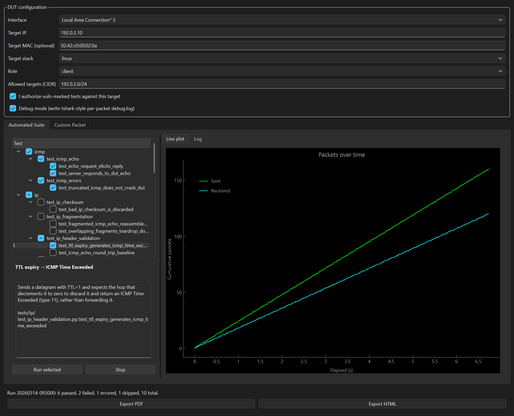
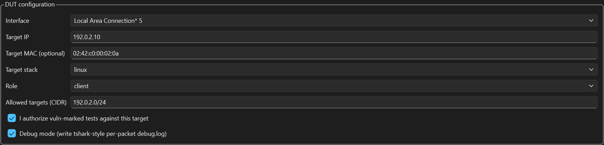
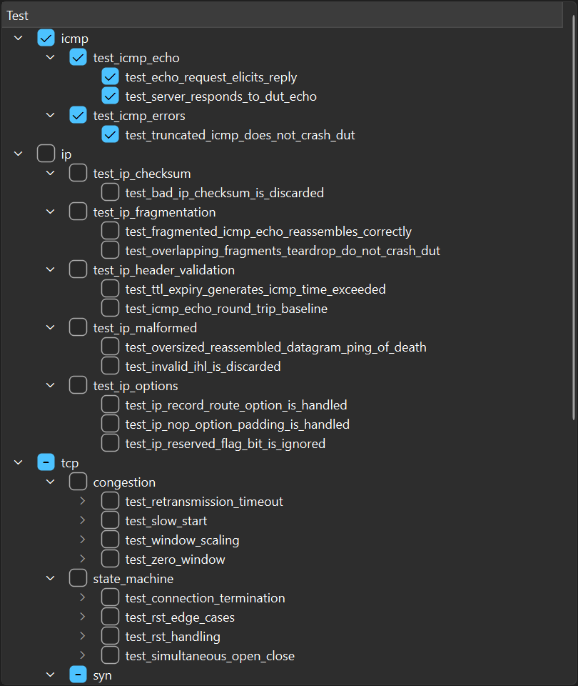
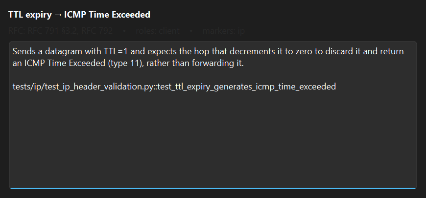
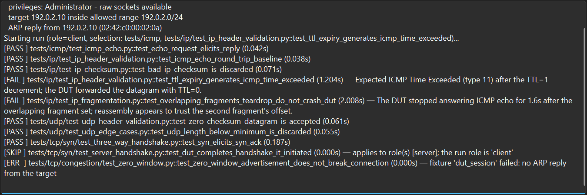
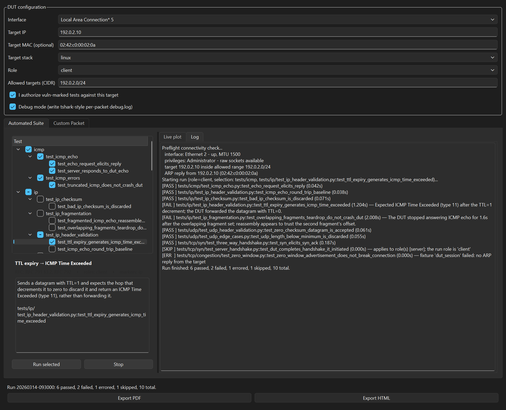
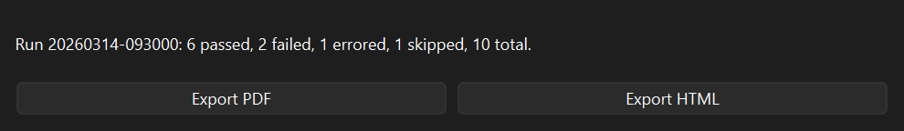
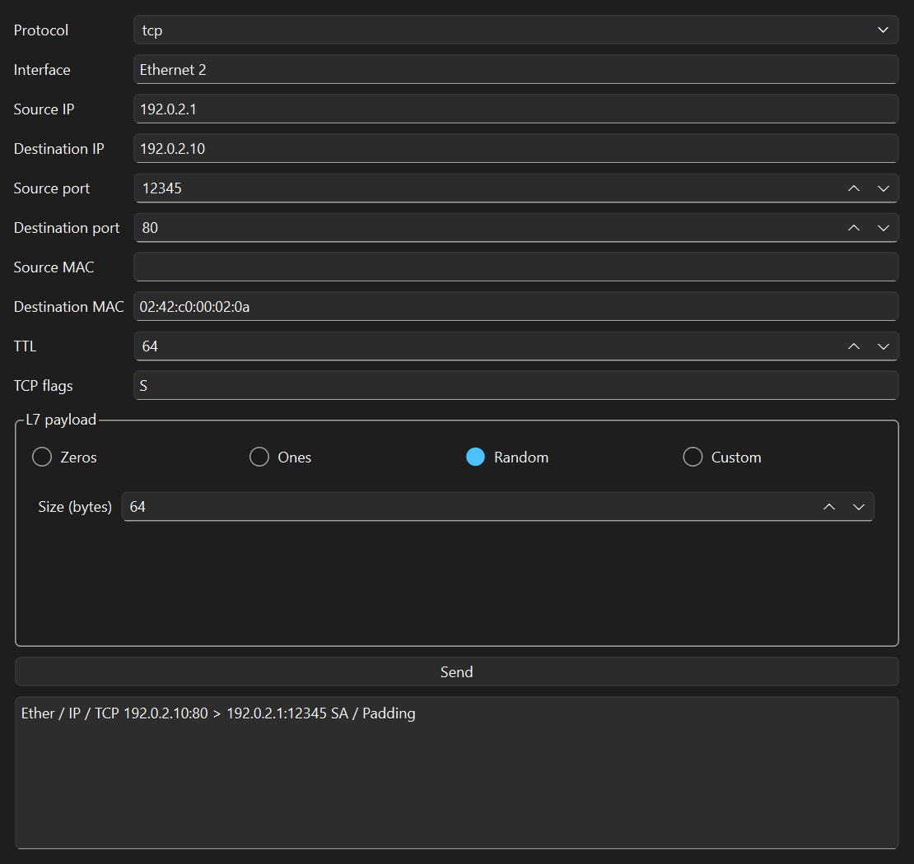
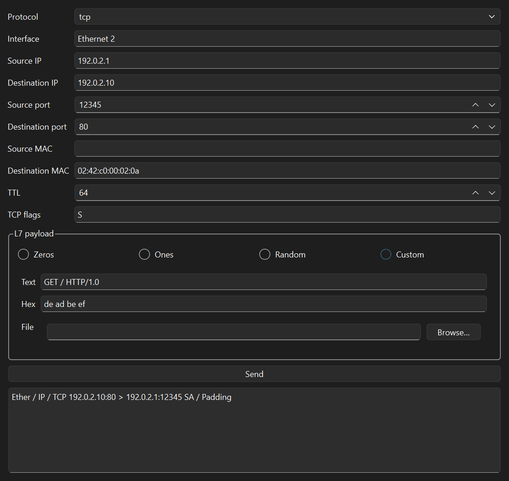

# src/gui — `netstack-gui` (PySide6 desktop app)

The graphical front end. Drives the **same** `runner.build_pytest_args`
subprocess as the CLI (via `QProcess`, so the Qt event loop never blocks),
and reuses `runner`'s file-tailing helpers under a `QTimer` — so a
GUI-triggered run is byte-for-byte identical to the CLI's and never drifts
in how results are parsed.

Requires the optional `gui` extra: `pip install -e ".[gui]"`.
Installed as `netstack-gui`.

## Modules

| Module | Widget / role |
|---|---|
| `app.py` | `main()` — `QApplication` entry point |
| `main_window.py` | `MainWindow` — top-level layout, config, wiring |
| `run_controller.py` | `RunController` — `QProcess` run driver, emits Qt signals |
| `test_tree_widget.py` | `TestTreeWidget` — checkbox picker, drills down to test functions |
| `test_details_panel.py` | `TestDetailsPanel` — description + RFC + roles of the selected test |
| `log_panel.py` | `LogPanel` — streaming output/results |
| `report_panel.py` | `ReportPanel` — PDF/HTML export |
| `custom_packet_panel.py` | `CustomPacketPanel` — ad-hoc send form |



Screenshots on this page are generated, not hand-captured — run
[`tools/generate_screenshots.py`](../../tools/generate_screenshots.py)
after any GUI change to refresh them.

## Layout

```
MainWindow
├── DUT configuration group  (interface, target IP/MAC, optional source
│                             port, destination port [blank = random],
│                             target stack, role, allowed CIDRs,
│                             vuln-confirm, debug checkboxes)
├── Tabs
│   ├── Automated Suite
│   │   ├── TestTreeWidget  +  Run / Stop
│   │   └── Tabs: RealtimePlotWidget (live plot) | LogPanel
│   └── Custom Packet  →  CustomPacketPanel
└── ReportPanel  (Export PDF / HTML)
```

## app.py

| Function | Signature | Description |
|---|---|---|
| `main` | `() -> None` | Self-elevates on Windows (`relaunch_module_as_admin` via UAC), then configures logging, creates the `QApplication` and `MainWindow`, runs the event loop. |

On Windows the GUI needs Administrator for raw sockets, so `main()`
relaunches itself elevated on startup (and the non-elevated instance
exits). Declining UAC continues non-elevated — the preflight check then
surfaces the privilege requirement on the first run. See
[`permissions.py`](../utils/README.md#permissionspy).

## main_window.py

`MainWindow(QMainWindow)` — builds the UI and connects `RunController`
signals to the plot/log/report widgets.

The DUT configuration group built by `_build_config_group()`:



| Method | Description |
|---|---|
| `_build_config_group()` | DUT config form: interface, target IP/MAC, optional **Source port** (spinbox showing `auto` at 0 → `None`), **Destination port** (spinbox showing `random` at 0), target stack, role, allowed CIDRs, plus the **Debug mode** and vuln-authorization checkboxes. |
| `_resolved_dst_port()` | The Destination port field, or a session-stable random ephemeral port (`src.config.random_ephemeral_port`) when it's left on `random`. Chosen once, then reused for every run in the session; logged on the run that first picks it. |
| `_build_suite_tab()` | Test tree + Run/Stop + live-plot/log tabs. |
| `_current_dut_config() -> DUTConfig` | Reads the form into a `DUTConfig`. |
| `_on_run_clicked()` | Switches to the Log tab, runs the **preflight** check (aborting with a logged reason on a hard blocker), derives scope from the tree, builds a `RunRequest` (with `debug`/`confirm_vuln_tests`), starts the controller. |
| `_on_finished(result)` | Updates the report panel and logs the final `passed/failed/errored/total` (or the error/no-tests reason). |
| `_on_test_event` / `_on_packet_event` / `_on_output_line` / `_on_finished` | Signal handlers → log panel, metrics buffer, report panel. |

Module helpers: `_selection_to_scope(paths)` maps a checked tree item to
`(module, submodule, test_name)`; `_list_interface_names()` enumerates
interfaces via Scapy's `get_working_ifaces()`.

## run_controller.py

`RunController(QObject)` — wraps a `QProcess` running the pytest
subprocess.

| Signal | Payload |
|---|---|
| `test_event` | `TestEvent` |
| `packet_event` | `PacketEvent` |
| `output_line` | `str` (raw stdout line) |
| `finished` | `TestRunResult` (also written to `results.json`) |

| Method | Description |
|---|---|
| `start(request)` | Allocates a run dir, launches the subprocess with `build_pytest_args`, starts a poll `QTimer`. |
| `stop()` | Kills the subprocess. |

On each timer tick it calls `runner.drain_test_events` /
`drain_packet_events` (the same parsers the CLI uses) and re-emits as Qt
signals.

## test_tree_widget.py

`TestTreeWidget(QTreeWidget)` — module → submodule → file → **test
function** hierarchy. Structure from a **filesystem walk** of `tests/`
(not `pytest --collect-only`, which would import every module and drag in
DUT concerns just to draw a picker); the per-file test functions and their
descriptions come from [`src/catalog.py`](../catalog.py).

Checkboxes **cascade**: checking a parent checks every descendant, and a
parent shows a partial (tri-state) check when only some children are
checked. Each node carries a pytest `target` (a path like `tests/ip` or a
nodeid like `tests/ip/test_x.py::test_a`); `checked_targets()` returns the
**minimal covering set** (a fully-checked node whose parent is also fully
checked is dropped, since the parent's target already covers it), and the
run passes those as explicit positional pytest targets — so checking a
module runs the whole module, and several independent selections run in one
invocation. `spec_of(item)` returns a test node's `TestSpec`.



`icmp` is checked in full; `tcp` shows the partial (tri-state) box because
only one test function beneath it is selected.

## test_details_panel.py

`TestDetailsPanel(QWidget)` — `show_spec(spec)` renders the selected
test's title, RFC connection, applicable roles, markers, and full
description. Updated from `MainWindow._on_tree_selection` as the tree
selection changes, so each test explains exactly what it checks.



## log_panel.py

`LogPanel(QPlainTextEdit)` — `append_line(text)`, `append_test_event(event)`
(prefixes PASS/FAIL/SKIP/ERR), `clear_log()`.



The Log tab is also what the main window switches to when a run starts — the preflight result and every outcome land here:



## report_panel.py

`ReportPanel(QWidget)` — `set_result(result)` remembers the latest run;
`Export PDF` / `Export HTML` buttons call `generate_pdf_report` /
`generate_html_report` via a save dialog.



## custom_packet_panel.py

`CustomPacketPanel(QWidget)` — the GUI twin of `netstack-cli send`. L3/L4
form fields + an L7 payload mode selector (Zeros / Ones / Random / Custom);
generated modes show a size field, Custom shows text/hex/file sub-fields.
`Send` builds a `CustomPacketSpec` and calls `send_custom_packet`,
displaying the reply (errors are shown in-panel, never crash the GUI).

The whole panel sits in a `QScrollArea` with a bounded content width, so
maximizing the window leaves the fields at a usable size instead of
stretching them across the screen.



Selecting **Custom** swaps the size field for the text/hex/file sub-form (the `QStackedWidget`):


