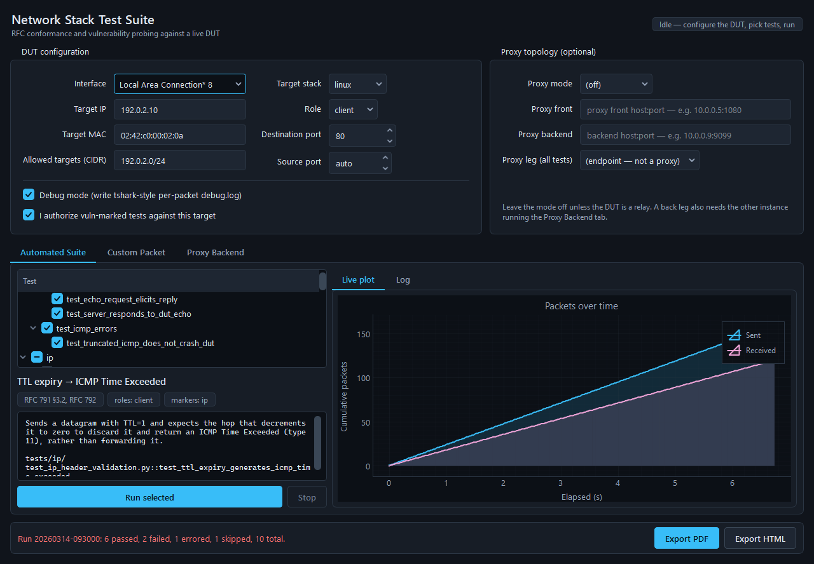
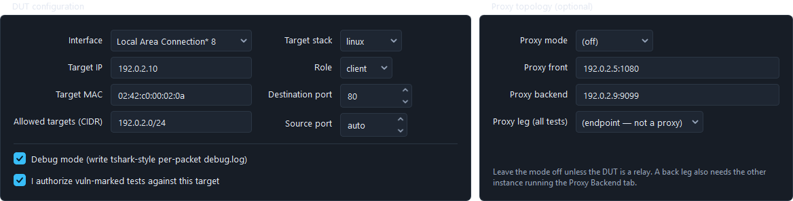
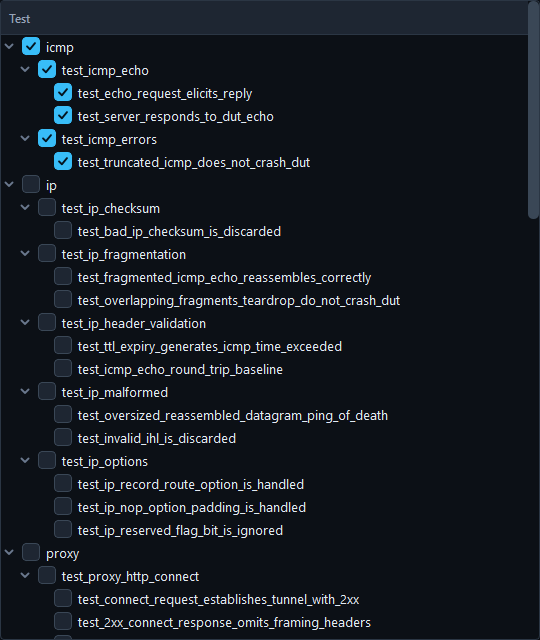
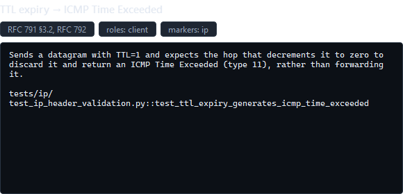
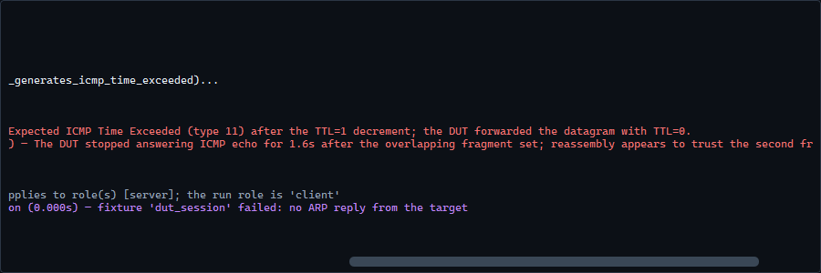
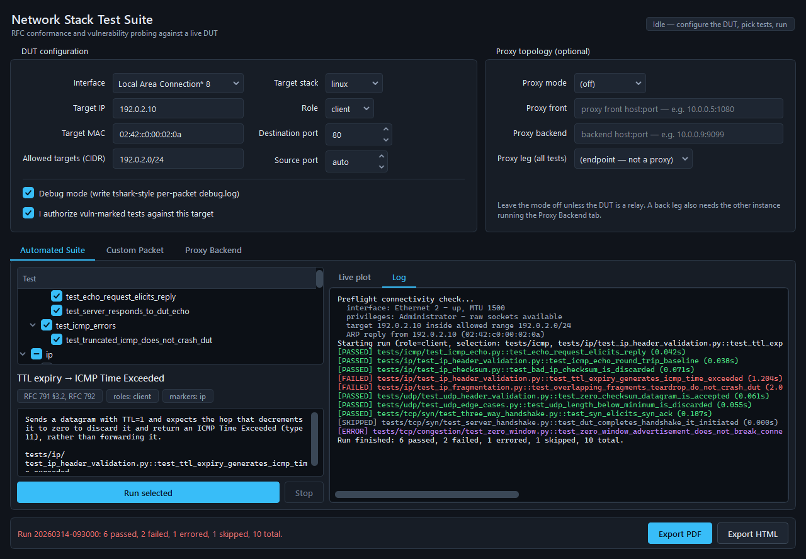
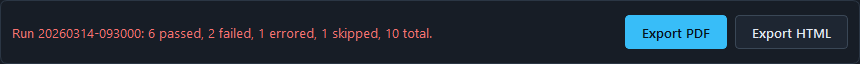
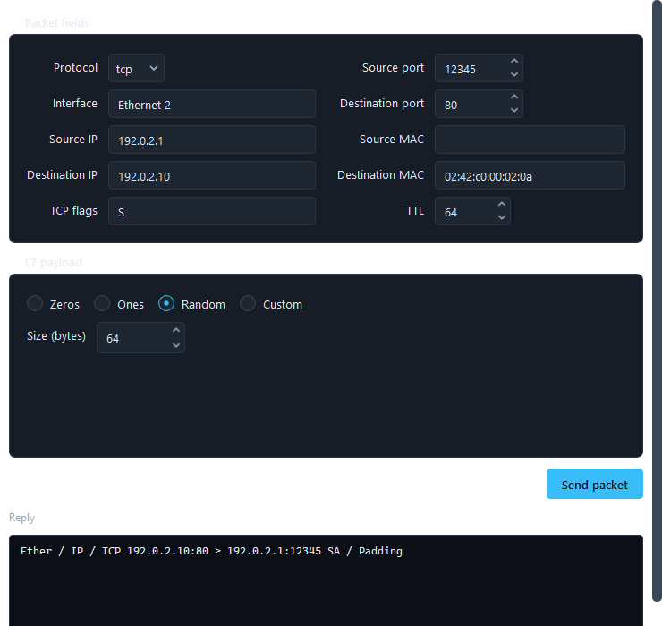
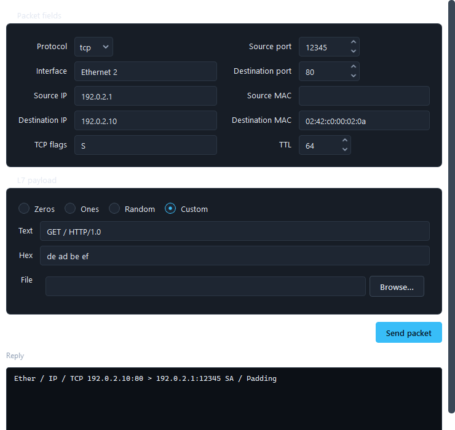

# src/gui — `netstack-gui` (PySide6 desktop app)

The graphical front end. Drives the **same** `runner.build_pytest_args`
subprocess as the CLI (via `QProcess`, so the Qt event loop never blocks),
and reuses `runner`'s file-tailing helpers under a `QTimer` — so a
GUI-triggered run is byte-for-byte identical to the CLI's and never drifts
in how results are parsed.

Requires the optional `gui` extra: `pip install -e ".[gui]"`.
Installed as `netstack-gui`.

## Modules

| Module | Widget / role |
|---|---|
| `app.py` | `main()` — `QApplication` entry point |
| `theme.py` | `apply_theme()` — the one stylesheet, palette and layout helpers |
| `main_window.py` | `MainWindow` — top-level layout, config, wiring |
| `run_controller.py` | `RunController` — `QProcess` run driver, emits Qt signals |
| `test_tree_widget.py` | `TestTreeWidget` — checkbox picker, drills down to test functions |
| `test_details_panel.py` | `TestDetailsPanel` — description + RFC + roles of the selected test |
| `log_panel.py` | `LogPanel` — streaming output/results |
| `report_panel.py` | `ReportPanel` — PDF/HTML export |
| `custom_packet_panel.py` | `CustomPacketPanel` — ad-hoc send form |
| `proxy_panel.py` | `ProxyBackendPanel` — run this instance as the origin a proxy DUT dials |



Screenshots on this page are generated, not hand-captured — run
[`tools/generate_screenshots.py`](../../tools/generate_screenshots.py)
after any GUI change to refresh them.

## Layout

```
MainWindow
├── Header          (title + run-state pill: idle / running / verdict)
├── Config bar
│   ├── DUT configuration   (interface, target IP/MAC, allowed CIDRs |
│   │                        target stack, role, destination port
│   │                        [random = session-stable ephemeral], optional
│   │                        source port; debug + vuln-confirm switches)
│   └── Proxy topology      (proxy mode/front/backend/leg — inert unless
│                            the DUT is a relay)
├── Tabs
│   ├── Automated Suite
│   │   ├── TestTreeWidget  +  Run / Stop
│   │   └── Tabs: RealtimePlotWidget (live plot) | LogPanel
│   ├── Custom Packet   →  CustomPacketPanel
│   └── Proxy Backend   →  ProxyBackendPanel
└── ReportPanel  (Export PDF / HTML)
```

## app.py

| Function | Signature | Description |
|---|---|---|
| `main` | `() -> None` | Self-elevates on Windows (`relaunch_module_as_admin` via UAC), then configures logging, creates the `QApplication` and `MainWindow`, runs the event loop. |

On Windows the GUI needs Administrator for raw sockets, so `main()`
relaunches itself elevated on startup (and the non-elevated instance
exits). Declining UAC continues non-elevated — the preflight check then
surfaces the privilege requirement on the first run. See
[`permissions.py`](../utils/README.md#permissionspy).

## theme.py

The whole application's look, in one place. `apply_theme(app)` is called
once from [`app.py`](app.py) before the first window exists (and by
[`tools/generate_screenshots.py`](../../tools/generate_screenshots.py), so
the images on this page are of the app as it ships).

| Function | Description |
|---|---|
| `apply_theme(app)` | Fusion base style + `QPalette` + default font + `stylesheet()`. |
| `stylesheet()` | The QSS, built from [`src/design_tokens.py`](../design_tokens.py). |
| `form_layout()` | A form column with the shared row rhythm — every form is built through it. |
| `divider()` | A hairline rule between a card's fields and its switches. |
| `refresh_style(widget)` | Re-polish after a property changed (Qt resolves property selectors at polish time). |

Widgets take a **role**, never a colour — no widget outside this module
carries a stylesheet of its own:

| Property | Effect |
|---|---|
| `accent="true"` on a `QPushButton` | filled primary action (Run selected, Send packet, Export PDF) |
| `danger="true"` on a `QPushButton` | Stop / destructive |
| `role="heading"` / `"subheading"` / `"caption"` / `"chip"` on a `QLabel` | type scale and metadata pills |
| `state="ok"` / `"bad"` / `"idle"` on a `QLabel` | status ink |
| `role="console"` on a text view | monospaced, sunken well |

Two Qt facts the module exists to absorb: a palette is needed *as well as*
a stylesheet (menus, tooltips, selection and the native file dialog never
read QSS), and styling a check box or combo arrow in QSS replaces Qt's
painted glyph with nothing — so the check, dash, dot and chevron glyphs
are drawn here into pixmaps (`@2x` included) and referenced by path.

The palette itself lives one layer down in
[`src/design_tokens.py`](../design_tokens.py), which imports nothing: the
live plot ([`plotting/realtime_plotter.py`](../plotting/realtime_plotter.py))
and the HTML report read the same tokens, so the widgets, the curves and
the exported document cannot drift apart.


## main_window.py

`MainWindow(QMainWindow)` — builds the UI and connects `RunController`
signals to the plot/log/report widgets.

The configuration bar built by `_build_config_bar()` — endpoint settings
and proxy topology as two cards:



| Method | Description |
|---|---|
| `_build_header()` | Title block and the run-state pill (`_set_status`), the one glanceable statement of what the window is doing; `_verdict()` derives its wording from the finished `TestRunResult`. |
| `_build_config_bar()` | The two configuration cards side by side — `_build_config_group()` and `_build_proxy_group()`. |
| `_build_config_group()` | DUT config form: interface, target IP/MAC, optional **Source port** (spinbox showing `auto` at 0 → `None`), **Destination port** (spinbox showing `random` at 0), target stack, role, allowed CIDRs, plus the **Debug mode** and vuln-authorization checkboxes. |
| `_resolved_dst_port()` | The Destination port field, or a session-stable random ephemeral port (`src.config.random_ephemeral_port`) when it's left on `random`. Chosen once, then reused for every run in the session; logged on the run that first picks it. |
| `_build_proxy_group()` | Proxy-DUT topology: mode, front, backend, leg. |
| `_build_suite_tab()` | Test tree + Run/Stop + live-plot/log tabs. `_set_running()` keeps Stop enabled only while a run is in flight. |
| `_current_dut_config() -> DUTConfig` | Reads the form into a `DUTConfig`, applying the **Proxy leg**: `front` retargets to the Proxy front address/port and forces the client role, `back` forces the server role (the leg implies the role, so it overrides the Role selector). |
| `_selected_proxy_leg() -> ProxyLeg \| None` | The Proxy leg combo, or `None` for ordinary endpoint testing. |
| `_on_run_clicked()` | Switches to the Log tab, runs the **preflight** check (aborting with a logged reason on a hard blocker), derives scope from the tree, builds a `RunRequest` (with `debug`/`confirm_vuln_tests`/proxy topology), starts the controller. A `back` leg with no proxy mode or backend address is refused here with an explanation — otherwise every server-role test would silently time out. |
| `_on_finished(result)` | Updates the report panel and logs the final `passed/failed/errored/total` (or the error/no-tests reason). |
| `_on_test_event` / `_on_packet_event` / `_on_output_line` / `_on_finished` | Signal handlers → log panel, metrics buffer, report panel. |

Module helpers: `_selection_to_scope(paths)` maps a checked tree item to
`(module, submodule, test_name)`; `_list_interface_names()` enumerates
interfaces via Scapy's `get_working_ifaces()`.

## run_controller.py

`RunController(QObject)` — wraps a `QProcess` running the pytest
subprocess.

| Signal | Payload |
|---|---|
| `test_event` | `TestEvent` |
| `packet_event` | `PacketEvent` |
| `output_line` | `str` (raw stdout line) |
| `finished` | `TestRunResult` (also written to `results.json`) |

| Method | Description |
|---|---|
| `start(request)` | Allocates a run dir, launches the subprocess with `build_pytest_args`, starts a poll `QTimer`. |
| `stop()` | Kills the subprocess. |

On each timer tick it calls `runner.drain_test_events` /
`drain_packet_events` (the same parsers the CLI uses) and re-emits as Qt
signals.

## test_tree_widget.py

`TestTreeWidget(QTreeWidget)` — module → submodule → file → **test
function** hierarchy. Structure from a **filesystem walk** of `tests/`
(not `pytest --collect-only`, which would import every module and drag in
DUT concerns just to draw a picker); the per-file test functions and their
descriptions come from [`src/catalog.py`](../catalog.py).

Checkboxes **cascade**: checking a parent checks every descendant, and a
parent shows a partial (tri-state) check when only some children are
checked. Each node carries a pytest `target` (a path like `tests/ip` or a
nodeid like `tests/ip/test_x.py::test_a`); `checked_targets()` returns the
**minimal covering set** (a fully-checked node whose parent is also fully
checked is dropped, since the parent's target already covers it), and the
run passes those as explicit positional pytest targets — so checking a
module runs the whole module, and several independent selections run in one
invocation. `spec_of(item)` returns a test node's `TestSpec`.



`icmp` is checked in full; `tcp` shows the partial (tri-state) box because
only one test function beneath it is selected.

## test_details_panel.py

`TestDetailsPanel(QWidget)` — `show_spec(spec)` renders the selected
test's title, its RFC/roles/markers as chips, and the full description. Updated from `MainWindow._on_tree_selection` as the tree
selection changes, so each test explains exactly what it checks.



## log_panel.py

`LogPanel(QPlainTextEdit)` — `append_line(text)`, `append_test_event(event)`
(prefixes PASS/FAIL/SKIP/ERR), `clear_log()`.

Monospaced, and each outcome line is inked from `design_tokens.OUTCOME_INK`
— the dark-background counterpart of the report's
[`reporting/palette.py`](../reporting/palette.py). In a run of a hundred
tests the four failures are what is being scanned for.



The Log tab is also what the main window switches to when a run starts — the preflight result and every outcome land here:



## report_panel.py

`ReportPanel(QWidget)` — the window's footer bar: the run verdict on the
left, the export buttons on the right. `set_result(result)` remembers the
latest run and enables the buttons (there is nothing to export before
one); `Export PDF` / `Export HTML` call `generate_pdf_report` /
`generate_html_report` via a save dialog.



## custom_packet_panel.py

`CustomPacketPanel(QWidget)` — the GUI twin of `netstack-cli send`. L3/L4
form fields + an L7 payload mode selector (Zeros / Ones / Random / Custom);
generated modes show a size field, Custom shows text/hex/file sub-fields.
`Send` builds a `CustomPacketSpec` and calls `send_custom_packet`,
displaying the reply (errors are shown in-panel, never crash the GUI).

The whole panel sits in a `QScrollArea` with a bounded content width, so
maximizing the window leaves the fields at a usable size instead of
stretching them across the screen.



Selecting **Custom** swaps the size field for the text/hex/file sub-form (the `QStackedWidget`):



## proxy_panel.py

`ProxyBackendPanel(QWidget)` — the GUI twin of `netstack-cli proxy-serve`.
Runs this instance as the **origin server** a proxy DUT dials out to, so the
other instance can drive traffic through the front. Listen address/port
(port `0` = `auto (ephemeral)`) plus an optional UDP echo, with live
`BackendStats` counters and an event log: a connection appearing here is
direct evidence the DUT's *client* leg works.

`MainWindow.closeEvent` calls `shutdown()` so the listening socket is
released when the window closes. See
[`docs/proxy_testing.md`](../../docs/proxy_testing.md).
