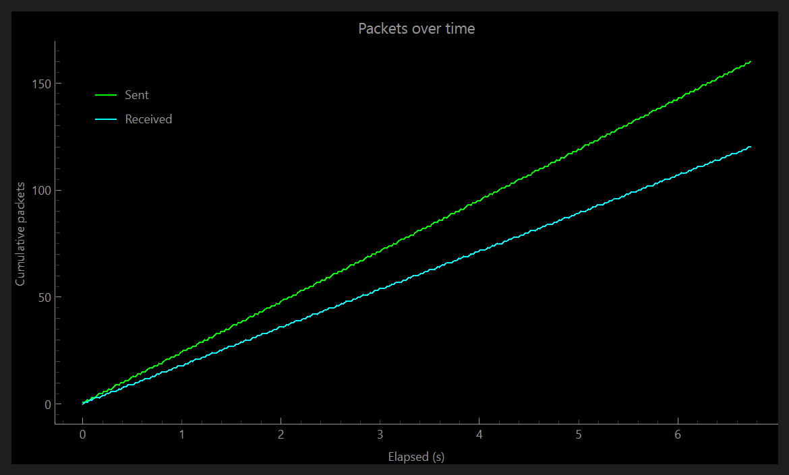
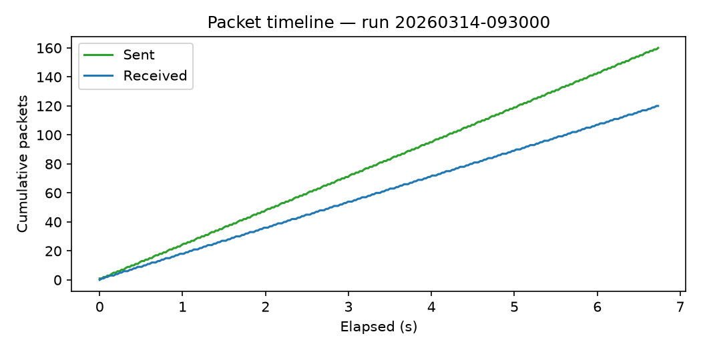
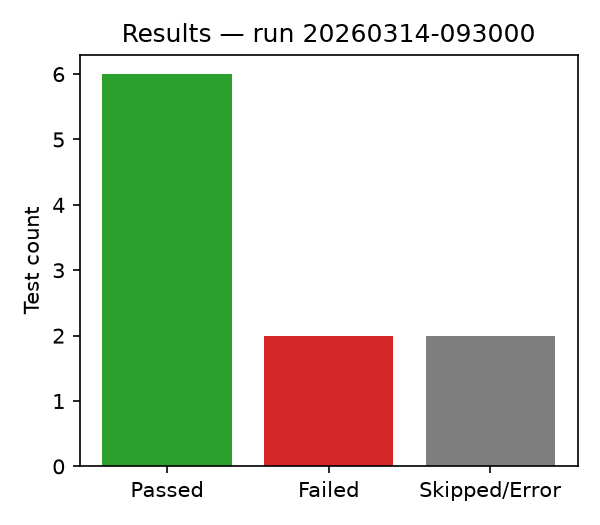

# src/plotting — live plot & static charts

Two rendering paths for the same underlying data, deliberately kept
separate because they have different constraints.

## Modules

| Module | Backend | Used by |
|---|---|---|
| `metrics.py` | — (data buffer) | both paths |
| `realtime_plotter.py` | pyqtgraph (Qt) | GUI live view |
| `static_charts.py` | matplotlib (Agg, headless) | PDF report embedding |

## Why two renderers

Live display needs pyqtgraph's frame-rate performance inside the Qt event
loop; report generation just needs one PNG per run with no interactivity
or threading. Using matplotlib/Agg for the report keeps it dependency-
light and headless-safe; pyqtgraph is only imported in the GUI path.

## metrics.py

Decouples packet **ingestion** (cheap, thread-safe append — a flood test
emits thousands of events in milliseconds) from **rendering** (pulled on a
timer). Emitting a Qt signal per packet would stall the event loop.

| Symbol | Signature | Description |
|---|---|---|
| `MetricsSnapshot` | dataclass | Parallel lists: `elapsed_s`, `sent_cumulative`, `received_cumulative`, `bytes_sent_cumulative`, `bytes_received_cumulative`. |
| `MetricsBuffer(max_points=100_000)` | class | Thread-safe accumulator fed by `NetworkInterface.on_packet`. Maintains cumulative series **incrementally** — `add()` is O(1), `snapshot()` is a plain copy (the old recompute-everything-per-tick was O(n) at 25Hz). `max_points` bounds memory / drawn points as a rolling window. |
| `MetricsBuffer.add` | `(event) -> None` | Update running totals, append one sample. |
| `MetricsBuffer.snapshot` | `() -> MetricsSnapshot` | Copy of the current cumulative series for plotting. |
| `MetricsBuffer.clear` | `() -> None` | Reset between runs. |

## realtime_plotter.py

| Symbol | Signature | Description |
|---|---|---|
| `RealtimePlotWidget(metrics, parent=None)` | `QWidget` | Embeds a pyqtgraph plot of cumulative sent/received. A `QTimer` (`FLUSH_INTERVAL_MS = 40`, ~25Hz) pulls a snapshot and redraws — cadence is decoupled from packet arrival rate. |
| `.reset` | `() -> None` | Clears the buffer and the curves (called on a new run). |

Requires the optional `gui` extra (PySide6, pyqtgraph).

Sent and Received are cumulative; the gap between them is probes that
drew no reply.

## static_charts.py

Forces the Agg backend at import (`matplotlib.use("Agg")`) — no display
needed, safe in CI and inside the pytest subprocess.

| Function | Signature | Description |
|---|---|---|
| `render_packet_timeline` | `(result, output_path) -> Path` | Cumulative sent/received vs. elapsed time → PNG. |
| `render_pass_fail_summary` | `(result, output_path) -> Path` | Passed / Failed / Skipped-or-Error bar chart → PNG. |

Both are consumed by `reporting/pdf_report.py`.

| `render_packet_timeline` | `render_pass_fail_summary` |
|---|---|
|  |  |
