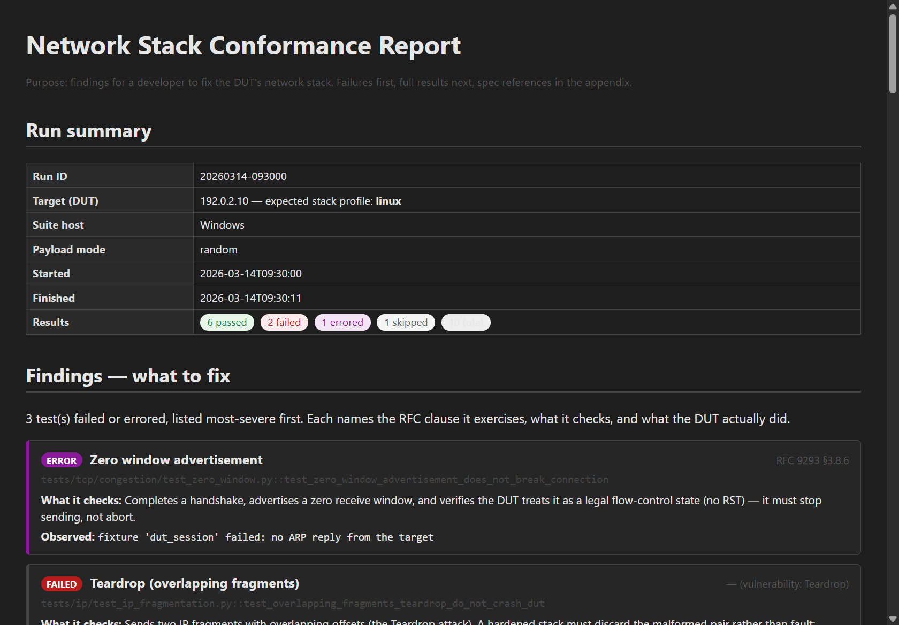

# src/reporting — result models & report generation

The single source of truth for "what happened in a run", plus the
generators that turn it into JSON, PDF, and HTML. Everything downstream —
the report-log parser, the packet-event log, the GUI live view, the PDF —
normalizes to the models here rather than re-deriving its own shapes.

## Modules

| Module | Responsibility |
|---|---|
| `models.py` | Canonical dataclasses + serialization |
| `report_data.py` | Shared report enrichment (findings, catalog, RFC list) |
| `collector.py` | Live packet-event log writer; reload a past run |
| `pdf_report.py` | reportlab PDF (embeds `plotting/static_charts` PNGs) |
| `html_report.py` | Standalone HTML |

## Report structure (HTML + PDF)

Both reports are written for a developer to fix the DUT's stack, and share
the same structure (via `report_data.py`, so they stay consistent):

1. **Run summary** — DUT, expected stack profile, host, pass/fail/error/skip counts.
2. **Findings — what to fix** — failures and errors first (errors first), each
   joined to its catalog **RFC clause**, **what it checks**, and the DUT's
   **observed** behaviour (the failure message).
3. **Artifacts & reproduction** — pointers to `capture.pcap` / `debug.log` for
   wire-level analysis, and the CLI command to reproduce the run.
4. **Full results** + charts.
5. **Appendix A — Test catalog** — every test, description, RFC, roles.
6. **Appendix B — RFC reference index** — the reading list.

*Findings lead the document: the failing test's title, its RFC clause,
what it checks, and what the DUT actually did.*

## report_data.py

| Symbol | Signature | Description |
|---|---|---|
| `Finding` | dataclass | A failed/errored `TestEvent` joined to its catalog `TestSpec` (`.rfc`, `.description`, `.title`). |
| `build_findings` | `(result) -> list[Finding]` | Failures + errors, errors first, each joined to its spec. |
| `catalog_by_group` | `() -> list[(str, list[TestSpec])]` | Full catalog grouped by module[/submodule] for Appendix A. |
| `referenced_rfcs` | `() -> list[(label, title)]` | Distinct RFCs the suite references, for Appendix B. |
| `reproduction_command` | `(result) -> str` | Approximate `netstack-cli run …` command to reproduce. |

## models.py

| Symbol | Description |
|---|---|
| `PacketDirection` | `Enum`: `SENT` / `RECEIVED`. |
| `PacketEvent` | `timestamp`, `direction`, `summary`, `size_bytes`, `test_nodeid`. `.to_dict()`. |
| `TestOutcome` | `Enum`: `PASSED` / `FAILED` / `SKIPPED` / `ERROR`. |
| `TestEvent` | `nodeid`, `outcome`, `duration_s`, `markers`, `message`. `.to_dict()`. |
| `TestRunResult` | The whole run: `run_id`, timestamps, `target_ip`, `target_stack`, `host_platform`, `payload_mode`, `pytest_returncode`, `tests`, `packet_events`. |

`TestRunResult` members:

| Member | Signature | Description |
|---|---|---|
| `.passed` / `.failed` / `.total` | properties `-> int` | Test counts. |
| `.errored` | property `-> bool` | True when `pytest_returncode >= 2` — pytest itself failed to run the tests (collection/usage error, no tests), distinct from a test assertion failure. |
| `.to_dict` | `() -> dict` | JSON-ready. |
| `.from_dict` | `classmethod (dict) -> TestRunResult` | Inverse — round-trips through `results.json`. |

> The `Test*` classes set `__test__ = False` so pytest doesn't try to
> collect them as test classes.

## collector.py

| Symbol | Signature | Description |
|---|---|---|
| `PacketEventLogWriter(path)` | callable | Wired as `NetworkInterface.on_packet`. `__call__(event)` appends one JSON line and **flushes immediately**, so `runner`'s tailing reader (parent process) sees it promptly. `.close()` when done. |
| `load_run_result` | `(run_dir) -> TestRunResult` | Reopens `results.json` to regenerate a report without re-running the suite. |

## pdf_report.py

| Function | Signature | Description |
|---|---|---|
| `generate_pdf_report` | `(result, output_path) -> Path` | Builds a PDF: metadata table, pass/fail bar + packet-timeline images (rendered via `plotting/static_charts`), and a per-test detail table with failed rows highlighted. |

## html_report.py

| Function | Signature | Description |
|---|---|---|
| `generate_html_report` | `(result, output_path) -> Path` | Self-contained HTML with a color-coded results table. Faster than the PDF path for dev; the PDF is the primary deliverable. |
